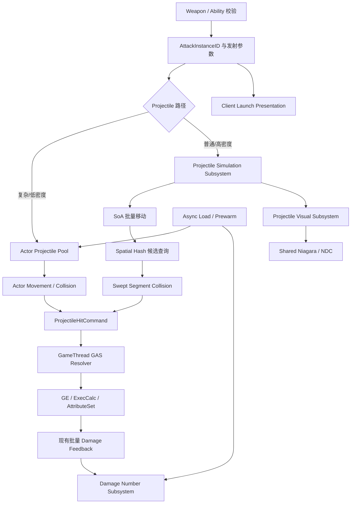

# Project Arcane Arena 子弹、伤害数字与高密度弹幕性能设计

## 1. 文档职责与当前状态

- 状态：`Planned`。
- 创建／最后更新：2026-09-21。
- 源码分析基线：`develop`，HEAD `c48c4fc`。
- 目标：以可重复压测为基线，先通过对象复用、异步资源准备和分帧预热消除生命周期尖峰，再为持续高密度弹幕建立数据导向集中模拟、空间哈希碰撞、批量客户端表现、轻量网络同步和可选并行计算路径。
- 本文记录设计、修改入口、实施顺序和验收标准，不表示相关系统已经实现或性能收益已经验证。
- `IMPLEMENTED_FEATURES.md` 继续作为全项目实现状态的规范记录；进入实现阶段后，同步更新真实完成的功能，并将尚未完成的验证写入 `PENDING_VERIFICATION.md`。
- 本文及关联方案的文档变更不代表玩法代码或资产已完成，不改变现有功能状态和历史验收结论。

状态统一使用 `Planned`、`Partial`、`Implemented`、`Verified`。后续阶段范围、网络职责、接口或实际进度变化时，应同步维护本文。


### 1.1 与自动射击重构的关系

[多武器自动射击与限时生存重构方案](SURVIVOR_SHOOTER_REFACTOR_DESIGN.md) 定义类似《土豆兄弟》的武器实例、自动攻击调度、限时波次、构筑与商店方向。本文负责其中的 Projectile 生命周期、高密度弹道模拟、碰撞、表现、网络预算和性能验收。

两份文档共同采用以下性能演进顺序，任何阶段都必须保留上一阶段的固定压力场景作为对照：

```text
Baseline：Spawn / Destroy Actor
→ V1：Pooled Actor Projectile
→ V2：Data-Oriented Projectile Simulation
→ V3：Spatial Hash + Swept Collision
→ V4：Shared Niagara / Niagara Data Channel 表现
→ V5：Launch Reconstruction / 轻量网络
→ V6：Chunked Parallel Simulation（有采样证据后）
```

- Actor 对象池可以独立服务当前 Fireball、敌方远程弹和低密度特殊 Projectile，不依赖自动武器系统先完成。
- 自动武器高密度普通弹不以“一颗子弹一个永久复制 Actor”为最终目标；达到规模化阶段后使用集中模拟路径。
- 两条路径最终都汇入同一 GAS 权威命中结算，不建立第二套 Health／Shield／Crit／Burning 数值系统。
- 自动射击方案需要补充整组发射、`AttackInstanceID`、Projectile ID、穿透命中集合及弹跳／分裂状态；这些当前均为 `Planned`。
- MassEntity 不是默认 Projectile 后端。项目已有 Mass 学习代码保留为实验和对照；是否迁移由基准数据决定，不因为“Mass 更适合大量实体”而提前增加架构复杂度。
- 两份文档使用各自阶段编号；跨文档依赖以自动射击方案的阶段表为玩法入口，以本文阶段表为性能入口。

## 2. 目标、范围与基本约束

### 2.1 玩家可感知的目标

1. 连续发射和密集命中时，减少 Actor／Widget 创建、销毁及垃圾回收带来的卡顿。
2. 大量伤害数字出现时，仍能辨认暴击、Shield、Health 和破盾反馈。
3. 子弹复用不改变发射方向、命中规则、伤害归属、Burning、冷却和消耗。
4. 顶视角、第三人称以及两人 Listen Server 使用同一套权威战斗规则。

对象池只减少对象生命周期开销，不自动消除活跃子弹的移动、碰撞、网络复制和粒子开销。最终收益必须通过固定压力场景的性能采样确认，不预先承诺 FPS 或支持数量。

### 2.2 首版范围

- `AArenaFireballProjectile` 与 `AArenaEnemyProjectile` 池化。
- 现有 `AArenaDamageNumberActor`／`UArenaDamageNumberWidget` 池化。
- 数据驱动的容量、预热、扩容及显示预算。
- 子弹每次发射的独立生命周期、网络状态和来源数据。
- 性能统计、压力场景和生命周期回归。

首版不池化敌人、Pickup、LightningStorm Area 或所有 GameplayCue Actor；不引入第三方池插件，不修改引擎源码，不把所有子弹直接重写为 Mass 或集中弹幕模拟。

### 2.3 两层 Projectile 路径

为兼容现有技能并支持后续上千发简单弹道，Projectile 分成两条明确路径：

| 路径 | 适用对象 | 运行模型 | 设计目的 |
|---|---|---|---|
| Actor Projectile | Fireball、敌方可辨认弹体、复杂特殊弹 | 预热并池化的 `AActor + Component` | 保留现有行为、复制和复杂碰撞能力 |
| Data Projectile | 自动武器普通直线弹、散射弹、穿透弹 | WorldSubsystem 中的连续数据 + 集中更新 | 降低 UObject、Component、Movement、碰撞和复制的持续成本 |

首轮对象池阶段不会强制把现有 Fireball 改成 Data Projectile。Data Projectile 先在独立压力场景和新自动武器上验证，再决定哪些旧弹体值得迁移。

Data Projectile 的逻辑身份不得依赖数组下标长期稳定，使用 `ProjectileID + Generation` 或等价代次句柄。视觉粒子、GAS EffectContext 和延迟回调都不得持有可能被复用后指向另一发弹体的裸索引。

### 2.4 权限与玩法边界

- 服务器独占子弹激活、碰撞结果、伤害和回收决策。
- 属性修改仍通过 GameplayEffect、ExecCalc 和 AttributeSet。
- 本地伤害数字、粒子降级和显示预算不拥有玩法状态。
- 已经命中的伤害不因为表现预算不足而跨帧排队结算。
- 不根据任意一个玩家的屏幕可见性停止服务器碰撞或销毁玩法子弹。
- 保留现有双视角 TargetData 路径，不在子弹或数字管理器中重新采集瞄准输入。

## 3. 当前实现与接入位置

### 3.1 玩家火球

```text
UArenaGameplayAbility_Fireball::OnTargetDataReady
→ CommitAbility
→ 服务器 SpawnFireballProjectile
→ SpawnActorDeferred<AArenaFireballProjectile>
→ InitializeProjectile：写入伤害与 Fire 构筑参数
→ FinishSpawning / BeginPlay：设置运动与寿命
→ 服务器 overlap / hit
→ GE_Damage，必要时施加 Burning
→ FinishProjectile / Destroy
```

当前已存在 TargetData 单次消费和服务器单次生成保护。升级读取在发射时完成，之后的伤害仍通过原有 GAS 管线。

### 3.2 敌方远程子弹

```text
UArenaGameplayAbility_EnemyAttackBase：激活、Commit、动画与取消
→ UArenaGameplayAbility_EnemyRangedAttack::ExecuteAttack
→ SpawnActorDeferred<AArenaEnemyProjectile>
→ InitializeProjectile / FinishSpawningActor
→ 服务器玩家 overlap 或世界阻挡
→ GE_Damage / FinishProjectile / Destroy
```

子弹发射后不追踪原 AI 目标，任意存活玩家可拦截。Dash 无敌玩家仍消费子弹，伤害由 ExecCalc 拒绝。敌方子弹当前使用 `UParticleSystemComponent`，不能直接按 Niagara 组件处理。

### 3.3 伤害数字与反馈

```text
UArenaAttributeSet：实际 Shield / Health 损失
→ QueueDamageFeedback
→ UArenaAbilitySystemComponent::QueueAuthoritativeDamageFeedback
→ 同目标、同 Tick 的反馈批次
→ MulticastExecuteGameplayCueBatch
→ UArenaHitReactionComponent::PresentDamageFeedbackBatch
→ SpawnDamageNumber
→ 本地 AArenaDamageNumberActor + 屏幕空间 WidgetComponent
→ Actor Tick 上浮、渐隐，寿命结束销毁
```

项目已经具有不可靠视觉批量 Multicast，以及只携带汇总分类的可靠结果音 Multicast。每段伤害保留独立数字，角色闪光、HUD 和 CameraShake 按批次汇总。池改造应复用此入口，不新增一套逐命中 RPC。

当前数字约持续 `0.9s`，使用五槽偏移、Ease-Out 上浮与末段渐隐。旧数字 GameplayCue 兼容入口仍需接入同一管理器，避免形成第二条创建路径。

### 3.4 主要源码

| 文件 | 重点修改职责 |
|---|---|
| [ArenaGameplayAbility_Fireball.cpp](Source/ProjectArcaneArena/Private/GAS/ArenaGameplayAbility_Fireball.cpp) | 在 Commit 前预留对象，替换 SpawnFireballProjectile 的直接创建 |
| [ArenaGameplayAbility_EnemyRangedAttack.cpp](Source/ProjectArcaneArena/Private/GAS/ArenaGameplayAbility_EnemyRangedAttack.cpp) | 从预留对象发射，保留当前目标与发射时机规则 |
| [ArenaGameplayAbility_EnemyAttackBase.cpp](Source/ProjectArcaneArena/Private/GAS/ArenaGameplayAbility_EnemyAttackBase.cpp) | 提供提交前资源预留及取消清理扩展点，近战默认无额外行为 |
| [ArenaFireballProjectile.cpp](Source/ProjectArcaneArena/Private/Projectile/ArenaFireballProjectile.cpp) | 拆分每次发射初始化、伤害消费、Burning 上下文和回收 |
| [ArenaEnemyProjectile.cpp](Source/ProjectArcaneArena/Private/Projectile/ArenaEnemyProjectile.cpp) | 拆分运动、粒子启动、命中与回收 |
| [ArenaHitReactionComponent.cpp](Source/ProjectArcaneArena/Private/Components/ArenaHitReactionComponent.cpp) | 数字请求交给本地管理器；保留其他批次反应 |
| [ArenaDamageNumberActor.cpp](Source/ProjectArcaneArena/Private/UI/ArenaDamageNumberActor.cpp) | 增加激活、重置、回收和集中动画更新入口 |
| [ArenaDamageNumberWidget.cpp](Source/ProjectArcaneArena/Private/UI/ArenaDamageNumberWidget.cpp) | 复用时重置文本、颜色、字号和动画状态 |
| [ArenaAbilitySystemComponent.cpp](Source/ProjectArcaneArena/Private/GAS/ArenaAbilitySystemComponent.cpp) | 保留批次发送，检查表现上下文及兼容 Cue 不重复显示 |
| [ArenaAttributeSet.cpp](Source/ProjectArcaneArena/Private/GAS/ArenaAttributeSet.cpp) | 检查来源位置、技能归属解析与复用 Actor 引用的关系 |

对应 Public 头文件须同步调整声明、反射属性和中文职责注释。


## 4. 目标架构

### 4.1 双路径总体架构



高密度路径的核心原则是：

```text
GA = 一轮攻击语义
Projectile Simulation = 飞行与命中候选
HitCommand = 跨阶段结果载体
GAS = 权威伤害与状态结算
Niagara / HUD = 可降级表现
```

### 4.2 建议新增类型

以下名称为设计建议，尚未实现。

| 类型 | 职责与生命周期 |
|---|---|
| `UArenaProjectilePoolSubsystem` | World 级 Actor Projectile 池；维护空闲、预留、活跃及待回收集合 |
| `UArenaProjectileSimulationSubsystem` | World 级高密度弹道模拟；集中管理 Data Projectile 的生成、更新、寿命和命中命令 |
| `FArenaProjectileStorage` | 连续存储；优先采用 SoA 保存 Position、PreviousPosition、Velocity、Lifetime、Radius、ID 等热数据 |
| `FArenaProjectileHandle` | `ProjectileID + Generation` 句柄，防止槽位复用后旧回调误操作新弹 |
| `FArenaProjectileHitCommand` | 模拟阶段产生的命中结果；主线程统一接入 GAS，不在工作线程操作 ASC |
| `FArenaProjectileSpatialGrid` | 空间哈希宽相；维护敌人或可命中目标的 Cell 注册与局部候选查询 |
| `UArenaProjectileVisualSubsystem` | 客户端高密度弹体表现；把逻辑弹体映射到共享 Niagara / NDC，不拥有伤害状态 |
| `AArenaProjectileStressTestActor` | 固定发射率、寿命、碰撞、VFX、Replication 开关的压力测试入口 |
| `UArenaDamageNumberSubsystem` | 本地表现服务；管理数字请求、池、预算和集中更新 |
| `UArenaCombatPoolConfig` | DataAsset；配置 Actor 池容量、预热、扩容预算、数字预算和统计开关 |
| `FArenaProjectileLaunchParams` | 单次发射参数；包含来源、伤害配置、Transform、速度、寿命和攻击身份 |
| `FArenaProjectileActivationState` | Actor Projectile 面向客户端的最小复制状态 |
| `FArenaProjectileReservation` | Actor Projectile 一次性预留句柄；绑定池、对象和代次 |

Actor 池按实际 Blueprint Class 分桶，不用一个超大基类池混合不同资源。Data Projectile 则按实际热路径决定是否按行为类型分桶，避免在每颗弹的更新循环中进行大量虚调用或 GameplayTag 分支。

池通过 GC 可追踪容器持有 UObject 引用；纯数据存储只保存稳定句柄、弱对象引用或可验证的来源索引。异步回调使用 World／Generation 检查。World 销毁时两条路径都必须清空，不在 GameInstance 中保留旧关卡运行态。

Dedicated Server 不创建数字对象、Widget、音频或客户端粒子。多 PIE World 相互隔离；本地表现不得固定使用全局第一个 PlayerController。

## 5. 子弹生命周期与复用协议

### 5.1 状态与接口

```text
Inactive → Reserved → Active → Returning → Inactive
                └─ 提交失败或取消 ───────────→ Inactive
```

上述状态属于对象生命周期，不增加 `State.*` GameplayTag。

概念接口如下，不是可直接粘贴的最终 API：

```cpp
TryReserveProjectile(ProjectileClass, OutReservation);
PrepareForLaunch(Reservation, LaunchParams);
ActivateProjectile(Reservation);
ReleaseProjectile(Generation, ReleaseReason);
ResetForPool();
```

`BeginPlay` 只负责一次性初始化。构造函数创建固定组件，永久碰撞委托只绑定一次；每次发射和回收通过独立入口完成。新建的预热对象默认空闲，不能在 `BeginPlay` 自动移动、播放特效或设置销毁倒计时。

### 5.2 激活顺序

1. 校验 World、对象、预留句柄及来源仍有效，确认尚未消费预留。
2. 唤醒需要复制的对象，增加本次 `Generation`。
3. 在碰撞关闭时写入 Transform、Owner、Instigator、来源 ASC、GE、伤害类型与构筑参数。
4. 重置命中标记、速度、运动内部状态和碰撞忽略列表。
5. 恢复 `ProjectileMovement->UpdatedComponent`，再设置速度并启用运动。
6. 安排携带本次代次的到期回收，准备复制状态及本地表现。
7. 完整初始化后才打开权威碰撞；开启碰撞也可能立即触发 overlap，后续逻辑必须容忍当场命中回收。

本地 UE 源码中的 `UProjectileMovementComponent::StopSimulating()` 会清空 `UpdatedComponent`。复用时只恢复 Velocity 不足以保证再次飞行。

### 5.3 命中与回收

- 在执行 GE 前先占用命中消费标记并关闭重复伤害入口，防止 GAS 同步事件或被动技能重入。
- 同一次发射最多进入一次回收，重复 overlap、hit、超时回调应无副作用。
- 应用直接伤害、状态和既有事件之后完成清理；外部调用可能改变来源或目标生命周期，访问前重新校验。
- 回收时停止运动与组件 Tick、关闭碰撞、停止音频和粒子、清理本次 Timer／延迟任务，并移除临时忽略列表。
- 清理来源 ASC、SourceActor、Owner、Instigator、GE 类、伤害 Tag、数值、Burning 参数和本次缓存。
- 防止在旧命中回调尚未退栈时重新发射同一个对象，可将真正重新入空闲队列延至安全的帧末处理点。

取消 `InitialLifeSpan` 和普通 `SetLifeSpan` 的自动销毁路径，改用到期回收。正常战斗期不再 `Destroy` 池对象；World 结束和明确的池释放仍执行真实销毁及资源清理。

### 5.4 GE 上下文与来源稳定性

当前 Fireball 的直接伤害和 Burning 将子弹自身作为 `SourceObject`／`EffectCauser`。对象销毁模式下会失效的引用，在池化后可能一直有效却已经表示另一发子弹。

需要分别审计立即伤害、延后发送的 Cue 批次和持续 Burning：

- 持续效果使用稳定的来源对象及明确技能 Tag，不读取已复用子弹的当前发射配置。
- 需要固定位置的反馈保存位置快照；Burning 元素命中位置仍按现有规则使用目标实时位置，不重新引入首次命中坐标残留。
- 保持原始 Instigator／来源 ASC 归属；不能因子弹换了 Owner 而改变旧效果的击杀或伤害归属。
- 检查 `ResolveDamageSourceLocation`、伤害技能名称解析、事件 `OptionalObject2` 及统计消费者，避免依赖子弹当前状态。
- 发射参数只快照当前已快照的技能／构筑数据；不因池化擅自改变 GE 对 AttackPower 等属性的捕获时机。

首版优先使用已有 GE 上下文、稳定来源和 Spec Tag；只有现有字段不足时才扩展自定义 EffectContext。

## 6. 多人复制与客户端表现

### 6.1 每次激活的独立身份

建议将以下字段放在一份复制状态中统一处理：

```text
Generation
bActive
LaunchLocation
LaunchVelocity
ServerLaunchTime
Lifetime
```

只复制 `bActive` 不够：同一对象可能在两次网络更新之间经过 `true → false → true`，客户端看不到中间状态。代次变化必须触发完整重置，旧代次的 Timer、插值、拖尾和异步完成回调不能影响新代次。

处理重复通知应幂等；同一代次只启动一次表现。跨属性 RepNotify 顺序不可作为初始化保证，运动快照与激活状态要有明确的初始化协调，避免旧位置更新覆盖新发射位置。

### 6.2 首版复制策略

- 保留 `bReplicates = true` 和现有移动复制，先验证池化生命周期。
- 客户端不从服务器玩法池自行取出复制 Actor，不决定命中或回收权威状态。
- 空闲对象可进入 `DORM_DormantAll`；复用时先唤醒，再修改复制字段。
- 回收时发布 inactive 状态并请求更新，再按引擎休眠机制收尾；不能用直接关闭复制代替回收通知。
- 不把远移到地图外、隐藏或关闭碰撞当作保证客户端收到回收状态的手段；这些操作可能影响相关性，必须验证通知与相关性的交互。
- 快速连续复用时休眠切换也有成本，可依据采样配置空闲休眠延迟。
- 客户端首次收到 Actor、失去相关性后重建 Actor、迟收到激活状态时，都应从当前状态恢复正确表现。

属性复制保证状态收敛，不保证每个短暂中间状态都被观察到。首版不额外保证每一发极短寿命子弹都呈现完整飞行，但权威命中仍通过既有反馈路径显示；若实测需要完整发射事件，再单独设计有界事件流，而不是将所有高频操作改成可靠 RPC。

服务器预热不会自动消除客户端首次创建复制 Actor 的尖峰。验收必须分别采样服务器、Host 和远端客户端；必要时另做客户端表现组件预热。

### 6.3 后续可选优化

直线匀速子弹可评估由发射参数和服务器时间重建客户端轨迹，辅以权威终止或校正，减少运动复制。此项必须在首版通过后独立实现，验证时间同步、误差、丢包和相关性重入，不与首轮池化一起重写。

## 7. 异步加载、分帧预热与容量管理

### 7.1 三个不同阶段

| 阶段 | 内容 | 执行规则 |
|---|---|---|
| 资源准备 | Blueprint Class、Widget、粒子及依赖 | 软引用配合 `RequestAsyncLoad` 提前请求，避免战斗热路径同步加载 |
| 对象预热／扩容 | 创建 Actor、组件注册、Widget 初始化 | 游戏线程执行，受数量及时间预算共同约束 |
| 战斗取用 | 从可用池激活已准备对象 | 尽量立即完成，不排队延迟已提交的发射 |

不能在任意工作线程调用 `SpawnActor` 或创建 UMG。异步加载完成后的对象创建仍有游戏线程成本；单次创建无法被时间预算强行切开，因此预算是调度目标，不是硬实时保证。

### 7.2 预热时机与准备状态

- 战斗地图 Waiting 阶段准备首批容量；相关资源和最低容量就绪后才开放对应战斗入口。
- Upgrade 阶段补充下一波预计容量，不把池状态复制成玩家战斗 GameplayTag。
- 加载或预热失败要有明确失败状态、统计和恢复入口，不能永久阻塞开局或默认视为成功。
- 异步回调要校验 World 仍有效；切图取消请求，避免向旧 World 创建对象。
- 预热持有必要资源引用或加载句柄，防止准备后立即卸载。
- 检查现有 Ability／Character Blueprint 的硬引用链；新增软引用不意味着原硬引用资源就会延迟加载。
- 在 Asset Manager 或 Cook 配置中显式覆盖软引用资产，验证打包版冷启动，不以编辑器已缓存资源作为加载成功证据。

### 7.3 配置字段

`UArenaCombatPoolConfig` 建议包含：

| 配置 | 用途 |
|---|---|
| `ProjectileClass` / `DamageNumberClass` | 按实际资源类型分桶，明确软引用加载策略 |
| `PrewarmCount` | 首批创建数量 |
| `MaxPoolSize` | 含空闲、预留和活跃对象的总容量上限 |
| `MaxActiveCount` | 活跃对象上限，与总容量分开统计 |
| `MaxReservedCount` | 前摇或待提交请求可预留的上限 |
| `MaxCreatesPerFrame` | 分类型创建数量上限 |
| `PrewarmBudgetMs` | 预热及扩容共享时间预算，防止多个桶预算叠加 |
| `MaxVisibleNumbers` | 每个本地显示上下文的数字上限 |
| `MaxPendingNumberRequests` / `MaxRequestAge` | 数字队列长度及过期时间 |
| `NumberMergeWindow` / 合并开关 | 可选表现合并，默认保留逐段显示 |
| `IdleDormancyDelay` | 评估快速复用与休眠切换成本 |

以下只作为压测起点，不是正式默认值或容量承诺：

| 参数 | 建议起点 |
|---|---:|
| 每帧新建子弹 | 2–4 |
| 每帧新建数字对象 | 4–8 |
| 合计预热时间预算 | 0.5–1 ms／帧 |
| 数字预热数量 | 64 |
| 同屏活跃数字上限 | 128 |

子弹容量依据实测峰值与压力目标确定，可用“峰值发射率 × 有效寿命 + 前摇预留 + 余量”估算初值。实测时分别统计 Fireball 和敌方子弹，避免一类流量占满另一类资源。

### 7.4 池耗尽策略

玩法子弹和伤害数字采用不同策略。

**玩法子弹：**服务器在 `CommitAbility` 前获得有效预留。提交失败、预测拒绝、死亡、眩晕、取消及 World 结束都必须释放未消费预留。敌方远程攻击在前摇前预留，释放时消费，不改变现有动画发射时机。

达到硬上限时明确拒绝激活，不能已经扣费后静默不发射，也不能抢回正在飞行的子弹。单纯 `EndAbility` 不能代替 GAS 预测消耗与冷却的正确回滚，必须通过网络拒绝测试验证。前摇较长的预留本身应计入容量统计，防止资源被长期占用。

**伤害数字：**允许合并、替换低优先级项或丢弃过期显示请求；不能让队列无限增长，也不能因数字缺失阻止权威伤害、声音或 HUD 的正常反馈。

## 8. 伤害数字池与显示预算

### 8.1 最小接入

保留现有 `AArenaDamageNumberActor`、`UWidgetComponent` 和 Widget Blueprint。`UArenaHitReactionComponent::SpawnDamageNumber` 改为提交值对象请求，包含伤害值、暴击、反馈类型、世界位置及本地显示上下文。

请求入队时保存本次显示起点，避免目标在等待期间移动或销毁导致数字跳位。数字不应继续依赖已死亡目标的强引用才能播放完成。

管理器集中更新活跃数字，Actor 不再各自注册独立 Tick。动画结束归还池，空闲数字关闭组件更新并隐藏。Widget 只在预热或真正缺失时初始化，不每次重新创建。

### 8.2 完整重置

复用时重置：伤害文本、字号、颜色、暴击／破盾样式、绘制区域、透明度、起点、累计时间、RenderTransform 和 Blueprint 动画状态。

必须验证“暴击 → 普通”“破盾 → Health”“淡出结束 → 再激活”交替使用，防止大字号、金色、透明度或放大区域残留。保留当前五槽偏移和独立数字的默认表现。

### 8.3 可选合并与降级

- 正常负载维持每段实际结算一个数字。
- 压力下可以按目标、来源归属策略、资源反馈类别和暴击类别，在短窗口内合并显示。
- 暴击、破盾、本地玩家受伤等高优先级反馈保留单独表现或优先容量；具体优先级配置化。
- 不把普通与暴击混成无法解释的一个金色数字，不把 Shield 和 Health 分类无条件混合。
- 先做屏幕投影和距离筛选；不能用本地数字可见性修改服务器伤害。
- 数字请求有最大队列长度和时效，避免低帧率恢复后继续播放几秒前的旧伤害。

合并只改变表现，不合并 GE、OnDamage、OnCrit、OnKill、OnShieldBreak 或其他玩法事件。启用合并会改变当前逐段显示约定，实施时须同步更新实现日志和相应验证标准，不能悄悄覆盖已有验收语义。

如果 Actor／WidgetComponent 池化后 UI 成本仍显著，再独立迁移到每个本地玩家的 HUD 数字层，保留世界位置投影、DPI、双视角和多人显示归属。


## 9. 高密度 Projectile 持续成本路线

对象池只解决创建、销毁、组件初始化和 GC 尖峰，不能自动消除数百／数千个活跃 Actor 的 Movement、Collision、Replication 和 VFX 持续成本。高密度弹幕必须单独进入集中模拟阶段。

### 9.1 持续成本拆分

| 成本 | Actor 池阶段 | 高密度阶段 |
|---|---|---|
| 创建与销毁 | 池化、预热、限制扩容 | Data Projectile 使用槽位复用，不创建每发 UObject |
| 移动 | 空闲 Actor 停止 Movement／Tick | 连续数组批量更新 Position／Velocity |
| 碰撞 | 收紧碰撞通道、避免弹对弹 | Spatial Hash 宽相 + Swept Segment 窄相 |
| GAS | 保持权威 GE／ExecCalc | 模拟只生成 HitCommand，主线程批量解析 |
| VFX | 控制组件实例与灯光 | Shared Niagara / Niagara Data Channel |
| 网络 | Actor Dormancy、相关性、频率 | 复制发射参数／Seed／服务器时间，客户端重建轨迹 |
| 数字 | Actor／Widget 池与集中更新 | 必要时迁移 HUD 单层投影绘制 |
| 并行 | 不作为首轮前提 | 数据稳定后按 Chunk 并行模拟 |

### 9.2 Data Projectile 数据布局

第一版可用 AoS 快速验证正确性，但正式性能版本优先评估 SoA：

```cpp
struct FArenaProjectileStorage
{
    TArray<FVector> Positions;
    TArray<FVector> PreviousPositions;
    TArray<FVector> Velocities;
    TArray<float> Radii;
    TArray<float> RemainingLife;
    TArray<int32> PierceRemaining;
    TArray<uint32> ProjectileIDs;
    TArray<uint32> Generations;
    TArray<uint32> AttackInstanceIDs;
};
```

热路径只遍历移动和碰撞真正需要的数据，来源 ASC、武器定义、伤害配置等冷数据通过稳定句柄访问，避免每帧追逐大量 UObject 指针。

删除弹体采用 Free List、Swap Remove 或稠密槽位方案时，必须保证 Handle 与视觉映射不会因数组重排失效。具体容器策略以采样和代码复杂度共同决定。

### 9.3 Spatial Hash 与连续碰撞

禁止高密度阶段使用 `Bullets × AllEnemies` 全遍历作为最终实现。目标按世界 XY 平面注册到固定尺寸 Cell；Projectile 只查询自身运动线段覆盖的 Cell 及必要邻格。

```text
PreviousPosition
      │
      ├──── Swept Segment ────► CurrentPosition
      │              │
      │        查询经过的 Grid Cell
      │              │
      └────────► 局部 Target Candidates
                         │
                    Segment vs Sphere/Capsule
```

- CellSize 依据目标胶囊半径、典型 Projectile 速度和敌人密度压测确定，不写死为“万能值”。
- 高速 Projectile 使用 `PreviousPosition → CurrentPosition` 的扫掠检测，不能只检查当前点，避免低帧率或高速下穿透。
- 穿透弹保存本次发射的已命中目标集合或紧凑去重结构；同目标是否允许再次命中由武器规则定义。
- 世界静态障碍是否进入同一 Grid、使用简化几何或保留引擎 Query，单独按场景复杂度测量，不提前统一。

### 9.4 Hit Command Buffer 与 GAS 边界

模拟阶段不直接调用 `ApplyGameplayEffectSpecToTarget`，而生成只包含结算必要信息的命令：

```cpp
struct FArenaProjectileHitCommand
{
    FArenaProjectileHandle Projectile;
    uint32 AttackInstanceID;
    TWeakObjectPtr<AActor> SourceActor;
    TWeakObjectPtr<AActor> TargetActor;
    FVector HitLocation;
    FVector HitNormal;
    float BaseDamage;
    float SkillMultiplier;
    FGameplayTag DamageType;
};
```

单线程版本也先经过 Command Buffer，原因是它建立清晰边界：未来并行模拟时，工作线程只做数学、局部查询和命令写入；主线程重新验证 Target／Source 后统一构造 GE Spec、触发 ExecCalc、Burning 和事件。

已经确认的权威命中不得因为“每帧 GAS 预算”被随意延迟到后续帧。若真实命中量本身成为瓶颈，必须分析 GameplayEffect 构造和触发语义，而不是静默漏掉伤害。

### 9.5 Shared Niagara 与 Niagara Data Channel

高密度视觉目标是“很多逻辑弹体，少量 Niagara System Instance”，而不是一颗 Data Projectile 对应一个 Niagara Component。

客户端表现层接收：

```text
ProjectileID / Generation
Position / Velocity
VisualType
Spawn / Despawn / Impact
```

普通弹体可由一个或少量共享 Niagara System 批量表示；命中特效优先通过 Niagara Data Channel（NDC）提交 `HitPosition / HitNormal / VisualType / Scale` 等事件。表现预算允许降低拖尾、灯光和装饰粒子，但不能改变服务器命中结果，也不能让需要玩家躲避的敌方危险弹体完全不可辨认。

### 9.6 MassEntity 决策

项目已有 `MyMassMovementProcessor` 和 `MyMassClusterActor` 学习实现，但不作为高密度 Projectile 默认后端，原因包括：

- 当前 Mass 示例包含邻居全遍历的 Boids 逻辑，不代表 Projectile 热路径已经是高性能实现。
- Projectile 数据简单、生命周期短，WorldSubsystem + 连续存储更容易建立 Handle、碰撞、网络和 GAS 边界。
- Mass 的 Archetype／Processor 优势需要通过同一压力场景与自定义 SoA 实现对比后再决定是否值得迁移。

因此 Mass 可作为后续实验分支或敌群轻量化候选，不作为本设计完成条件。

### 9.7 可选并行模拟

只有 D/E 阶段单线程实现稳定且 Unreal Insights 表明 Projectile Simulation 仍是 GameThread 主要成本时，才进入并行化。

建议按固定 Chunk 拆分：

```text
Projectile 0..511
Projectile 512..1023
Projectile 1024..1535
...
```

工作线程允许：位置积分、寿命更新、只读 SpatialGrid 查询、局部命中判定、线程本地 HitCommand 写入。

工作线程禁止：`SpawnActor`、修改 UObject／ASC、创建 Widget、ApplyGameplayEffect、修改非线程安全 World 状态。任务完成后在 GameThread 合并命令并进入 GAS。

### 9.8 高密度网络路径

Actor Projectile 首版保留现有复制；Data Projectile 不为每颗普通弹建立长期复制 Actor。自动武器按“一轮攻击”复制或发送可恢复的最小参数：

```text
AttackInstanceID
WeaponInstanceID / VisualType
LaunchOrigin
BaseDirection
ProjectileCount
SpreadAngle / Pattern
Speed
Lifetime
RandomSeed
ServerLaunchTime
```

客户端使用相同 Seed 重建普通散射方向并按服务器时间推进表现。服务器仍独占碰撞与伤害；命中、终止或必要校正通过有界事件／状态补偿。不得为了省带宽把权威命中交给客户端，也不逐发发送可靠开火 RPC。

## 10. GAS、资产与配置影响

### 10.1 GAS 责任表

| 领域 | 设计要求 |
|---|---|
| Activation | 保留 Dead／Stunned／阶段阻断和单次 TargetData 消费；加入服务器资源预留 |
| Cost / Cooldown | 仍由 CommitAbility 处理；无预留不提交，失败验证预测回滚 |
| Attributes | 不直接写 Health、Shield、Energy；不改现有数值公式 |
| GameplayEffect | 继续每次构建正确来源的 Spec，不复用携带旧上下文的伤害 Spec |
| GameplayTag | 保留伤害、状态、构筑和技能 Tag；池生命周期不用 GameplayTag 表示 |
| GameplayEvent | 保持事件数量、顺序和递归保护；检查 SourceObject 消费者 |
| TargetData | 沿用共享双视角路径、服务端校验和既有发射方向处理 |
| Prediction | 本地仍可预测技能表现和消耗；不预测生成可伤害的权威池对象 |
| GameplayCue | 保留反馈批次与元素／结果顺序，清理不稳定上下文，防止新旧数字入口双播 |

### 10.2 资产与自动化

- 核对 `BP_ArenaFireballProjectile`、`BP_ArenaEnemyProjectile` 的组件默认激活、BeginPlay、Destroyed 和粒子自动销毁设置。
- 核对 `BP_ArenaDamageNumberActor`、`WBP_DamageNumber` 的初始可见性、默认 Tick 和动画复用行为。
- 新增池配置 DataAsset，并明确加载入口与 Cook 收录规则。
- 同步维护 `Content/Python/ranged_enemy/setup_ranged_enemy.py`、`Content/Python/damage_feedback/setup_damage_feedback_polish.py` 以及实际受影响的 `Content/Python/build_assets` 脚本，避免重新生成资产后恢复旧生命周期设置。
- 脚本必须幂等，只把成功保存并验证的资产配置记为已实现。
- 运行时检查蓝图配置是否覆盖了 C++ 池约束；不能仅凭源码默认值认定资产兼容。


## 11. 实施阶段与完成标准

| 阶段 | 状态 | 工作内容 | 完成标准 |
|---|---|---|---|
| A：基线与压力场景 | Planned | 新增固定 Projectile 压测入口；拆分 Actor、Movement、Collision、VFX、Replication、GAS 开关；保存 Insights 基线 | 同设备、分辨率、发射率、寿命和随机种子可重复运行，保存 Average/P95/P99 与线程证据 |
| B：伤害数字生命周期 | Planned | 数字池、集中动画、显示预算；必要时准备 HUD 单层迁移接口 | 样式复用无残留，密集命中不再持续 Spawn/Destroy 数字 Actor |
| C：Actor Projectile Pool | Planned | Fireball／EnemyProjectile 激活、回收、预留、Generation、异步加载与分帧预热 | 现有技能行为不变；稳定负载不再持续创建/销毁；记录相对 A 的收益和剩余瓶颈 |
| D：Data Projectile Core | Planned | 新自动武器接入 `UArenaProjectileSimulationSubsystem`；连续存储、Handle、集中寿命与移动 | 500/1000/2000 等阶梯下不依赖每发 Actor/MovementComponent，轨迹与寿命正确 |
| E：Spatial Hash Collision | Planned | Target 注册、Cell 查询、Swept Segment、穿透去重、HitCommand Buffer | 不全遍历全部敌人；高速弹不穿透；命中顺序与 GAS 结果正确 |
| F：批量表现 | Planned | `UArenaProjectileVisualSubsystem`、Shared Niagara、NDC Impact；VFX 预算 | 高密度普通弹不创建同数量 Niagara Component；表现降级不改变玩法 |
| G：轻量网络 | Planned | Attack launch 参数、Seed、ServerTime 客户端重建；必要终止/校正 | 高密度普通弹不使用每弹 ReplicateMovement；丢包/迟到后表现能收敛 |
| H：并行模拟 | Planned | 仅在单线程采样需要时按 Chunk 并行，线程本地 Command Buffer | 线程安全回归通过；GameThread Projectile 成本进一步下降且无命令丢失 |
| I：综合规模化验收 | Planned | 自动武器、敌群、真实 GAS、数字、VFX、网络组合压力；长时间运行 | 固定负载下帧时间、带宽、内存和对象数量稳定，并形成可用于简历的真实前后对照数据 |

默认按 A→C 建立兼容基线，再按 D→G 建立高密度路径。H 是证据驱动的可选阶段，不为了“使用多线程”而增加复杂度。I 只有在实际运行结果通过后才可标为 `Verified`。

当前实现进度：仅完成源码分析与设计更新；上述阶段均未实现或实测。历史战斗验收不等于高密度弹幕验收。

## 12. 验证计划与证据


### 12.1 性能基线

必须使用 Unreal Insights 和固定压力场景记录 Game／Render／GPU／Slate／GC／Physics／Network 成本，不以编辑器主观流畅或平均 FPS 单独作为结论。

Projectile-only 阶梯至少覆盖：

```text
100 / 250 / 500 / 1000 / 2000 / 5000 active projectiles
```

每个阶梯分别运行以下模式，避免把不同瓶颈混在一起：

```text
Data/Actor only
+ Movement
+ Collision
+ Visual
+ Network
+ Real GAS Hit
```

固定记录：

- 平均帧时间、P95、P99、最大尖峰。
- GameThread、RenderThread、GPU 时间。
- GC 次数与暂停、Actor／Component 数量。
- Projectile Simulation、SpatialGrid Query、Collision Candidate 数量和命中数量。
- Actor 池命中率、活跃／预留／空闲量、扩容次数。
- Niagara System Instance 数量与高密度表现开关。
- 网络吞吐、复制 Actor 数、每轮发射事件数量。
- 长时间运行后的内存平台期与待处理队列长度。

开发目标而非既成结果：在固定 1920×1080 压测配置下，最终综合场景以 `1000–2000` 活跃普通弹体、`100–200` 普通敌人和持续真实 GAS 命中作为主要验收区间，目标平均帧时间不高于 16.67ms，并重点控制 P95/P99 尖峰；Projectile 模拟自身争取控制在 1–2ms 量级。具体最终门槛必须由阶段 A 的机器、地图、特效档位和网络模式基线校准，未实测前不得写成已达成成果。

所有优化版本使用相同随机种子、发射率、寿命、碰撞规则、伤害频率和表现档位对照；不能通过少发 Projectile、漏伤害或关闭必要敌方弹体冒充性能提升。

### 12.2 功能与生命周期

| 场景 | 通过标准 |
|---|---|
| 同一对象连续复用 | 第二次及后续发射正常移动；一次发射最多结算一次伤害 |
| 玩家交替使用同一池对象 | Source ASC、Instigator、技能、Burning 和击杀归属正确 |
| Burning 持续期间复用火球 | 周期伤害和反馈不读取新一发子弹的位置或参数 |
| 撞墙、命中、无目标到期 | 各路径只回收一次，无残留碰撞和 Timer |
| GE / 被动同步重入 | 不重复命中，不把回调中的对象提前用于新一发 |
| 池耗尽与 Commit 失败 | 不抢回活跃子弹，不扣费后静默丢发射，无预留泄漏 |
| 敌人前摇死亡或 Stun | 释放预留，保持取消攻击语义，没有迟到发射 |
| 数字样式交替 | 暴击、普通、破盾、Health 的字号、颜色、透明度全部正确重置 |
| 目标死亡或离开视野 | 本次数字使用已记录位置；显示策略不影响伤害和事件 |
| 切图、结束 PIE、多次重开 | 无旧 World 引用、回调、残留对象或持续内存增长 |

### 12.3 双视角与多人

- 单人 PIE 分别验证顶视角和第三人称的 BasicAttack、Fireball、Dash、Shield、LightningStorm 及敌方子弹反馈。
- 飞行、命中、数字淡出、冷却期间切视角，不增加 Ability、子弹、区域 Actor、伤害或数字。
- 两人 Listen Server 独立选择视角，双方看到同一权威战斗结果；本地数字预算可以不同。
- 在 `150ms RTT + 2% / 5% Packet Loss` 下测试快速复用、激活／回收状态收敛和预测拒绝。
- 测试客户端首次接收大量子弹、失去相关性后重新接收、同网络间隔内多次复用以及旧回调晚到。
- Dedicated Server 无本地数字、Widget、音频和 VFX，客户端表现缺失不影响服务器伤害。
- Standalone 和 Packaged Build 冷启动验证资源收录、首次效果及最低容量准备，不能只做编辑器热缓存测试。

### 12.4 首版验收门槛

1. 已预热且容量充足的稳定场景中，正常取用／回收不再持续创建和销毁对应对象。
2. 固定峰值负载下，池总量不突破配置上限，预留与活跃计数准确，空闲对象没有无意义 Tick／碰撞。
3. 长时间运行的对象数量和内存趋于稳定，数字队列不会无界积压。
4. 在相同负载下提交改造前后采样，明确改善的是创建尖峰还是持续帧耗时，并列出尚存瓶颈。
5. 单人、双视角、Listen Server 及上述关键复用正确性场景完成；未完成项目明确记为待验证。

性能目标应在阶段 A 根据目标设备和演示负载确定。不能用降低实际伤害次数、减少应发射的子弹或关闭必要敌方弹体表现来冒充性能提升。

## 13. 工程验证与文档维护

- 每个阶段最小化修改范围，新增或修改函数补充准确的中文职责注释。
- 静态检查包含 includes、反射声明、复制字段、GC 引用、Timer／委托对称清理及 `git diff --check`。
- 为代次隔离、预留消费／释放、重复回收和容量边界编写必要的针对性测试；表现与网络行为仍需运行时验证。
- 遵守 `AGENTS.md` 的源码引擎构建安全规则，不执行全解决方案、引擎重建、Clean 或 `-NoSharedPCH`。
- 必要编译先确认 EngineAssociation、uproject diff 和已有构建／Live Coding 状态，再按已有授权及项目规则使用最小 Editor 目标。
- 实施后同步更新本文阶段状态及 `IMPLEMENTED_FEATURES.md`；未完成验证进入 `PENDING_VERIFICATION.md`。
- 若未来改动 Boss 技能或阶段行为，再同步对应 Boss 规划；本次通用池设计不改变 Boss 阶段进度。

## 14. 参考资料

- [UE 5.6 Actor Network Dormancy](https://dev.epicgames.com/documentation/en-us/unreal-engine/actor-network-dormancy-in-unreal-engine?application_version=5.6)：唤醒顺序、休眠与相关性的区别，以及快速切换的成本。
- [UE 5.6 Niagara Scalability and Best Practices](https://dev.epicgames.com/documentation/en-us/unreal-engine/scalability-and-best-practices-for-niagara?application_version=5.6)：组件池之外的实例、发射器和粒子预算。
- 本地 UE 源码 `Engine/Source/Runtime/Engine/Private/Components/ProjectileMovementComponent.cpp`：`StopSimulating()` 的状态清理。
- 本地 UE 源码 `Engine/Source/Runtime/Engine/Classes/Engine/StreamableManager.h`：`RequestAsyncLoad` 接口。
