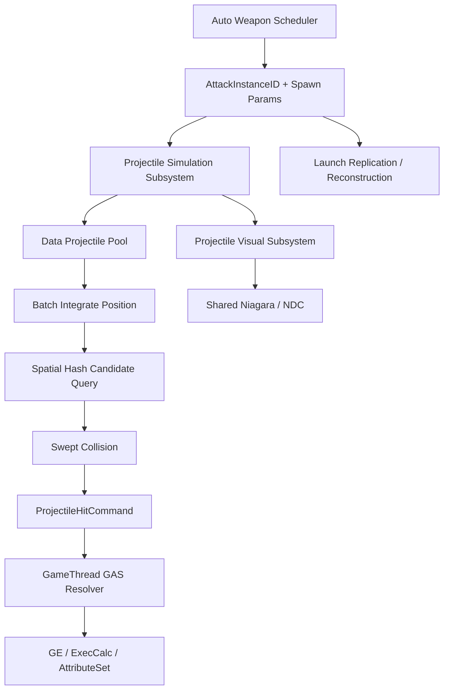

# Project Arcane Arena 高密度弹幕与 Projectile 数据池性能设计

## 1. 文档职责与当前状态

- 状态：`Partial`。
- 创建／最后更新：2026-09-21。
- 源码分析基线：`develop`，HEAD `c48c4fc`。
- 目标：为 Survivor 自动武器新建独立高密度 Projectile 系统，不改造现有 Fireball／EnemyProjectile 作为前置；从预分配 Data Projectile Pool 起步，逐步建立集中模拟、空间哈希碰撞、批量客户端表现、轻量网络同步和可选并行计算路径，并通过固定压力场景形成可量化性能证据。
- 本文记录设计、修改入口、实施顺序和验收标准，不表示相关系统已经实现或性能收益已经验证。
- `IMPLEMENTED_FEATURES.md` 继续作为全项目实现状态的规范记录；进入实现阶段后，同步更新真实完成的功能，并将尚未完成的验证写入 `PENDING_VERIFICATION.md`。
- 本文及关联方案的文档变更不代表玩法代码或资产已完成，不改变现有功能状态和历史验收结论。

状态统一使用 `Planned`、`Partial`、`Implemented`、`Verified`。后续阶段范围、网络职责、接口或实际进度变化时，应同步维护本文。


### 1.1 与自动射击重构的关系

[多武器自动射击与限时生存重构方案](SURVIVOR_SHOOTER_REFACTOR_DESIGN.md) 定义类似《土豆兄弟》的武器实例、自动攻击调度、限时波次、构筑与商店方向。本文专门负责**新自动武器弹幕系统**的 Projectile 数据生命周期、集中模拟、碰撞、表现、网络预算和性能验收。

本次架构决策：

- 现有 `AArenaFireballProjectile`、`AArenaEnemyProjectile` 继续维持当前 Actor 技能路径，不作为高密度弹幕重构的依赖。
- Fireball 是低频主动技能，即使未来需要池化，也属于独立 Profiling 结论，不影响 Survivor 弹幕系统推进。
- 新普通弹幕从第一版就采用 Data Projectile Pool；“池”仍然存在，但池化的是预分配数据槽位，不是 `AActor`。
- 高密度普通弹不创建每发 `AActor`、`USphereComponent`、`UProjectileMovementComponent` 或独立 Niagara Component。
- 新系统只在权威命中结算处接入现有 GAS；不复用 Fireball 的 TargetData、Ability 生命周期或 Projectile Actor 实现。
- MassEntity 不是默认 Projectile 后端。现有 Mass 学习代码只作为实验对照。

主性能路线调整为：

```text
P0：Legacy Actor Reference / 独立压力基线
→ P1：Data Projectile Pool + Central Simulation
→ P2：Auto Weapon 接入
→ P3：Spatial Hash + Swept Collision
→ P4：Spread / Pierce / 多武器
→ P5：Shared Niagara / Niagara Data Channel
→ P6：Launch Reconstruction / 轻量网络
→ P7：Chunked Parallel Simulation（仅在采样需要时）+ 综合规模化验收
```

其中 Legacy Actor 仅作为“传统实现成本参考”，不要求先完成 Actor Pool 优化。旧技能 Actor Pool 若未来需要，作为独立可选任务处理。

## 2. 目标、范围与基本约束

### 2.1 玩家可感知的目标

1. 自动武器持续高射速、散射和穿透时，帧时间随 Projectile 数量增长保持可控。
2. 大量 Projectile 与敌人同时存在时，移动、碰撞、伤害、视觉和网络职责彼此解耦。
3. 高密度表现可以按预算降级，但 Projectile 数量、真实命中、伤害和状态效果不能被静默削减。
4. 顶视角、第三人称以及两人 Listen Server 使用同一套权威战斗规则。

### 2.2 首版范围

首版只服务新的 Survivor 自动武器系统：

- 独立 `AArenaProjectileStressTestActor` 或等价测试入口。
- `UArenaProjectileSimulationSubsystem`。
- 预分配 Data Projectile Pool／Free List／Generation Handle。
- 普通直线 Projectile。
- 后续逐步加入 Spread、Pierce、Spatial Hash 和 Swept Collision。
- 统一 `FArenaProjectileHitCommand` 接入现有 GAS。
- 客户端批量 Projectile 表现。
- 固定压力场景和 Unreal Insights 证据。

首版明确**不要求**：

- 修改 `AArenaFireballProjectile`。
- 修改 `AArenaEnemyProjectile`。
- 给现有主动技能增加 Actor Pool。
- 把旧技能统一迁移到 Data Projectile。
- 重写现有 TargetData 或主动 Ability 流程。
- 使用 MassEntity 实现 Projectile。

伤害数字优化仍可作为高命中率场景的后续表现任务，但不阻塞 Projectile 核心系统。

### 2.3 系统边界

```text
Existing Active Skills
Fireball / Lightning / Enemy special projectile
        │
        └── Existing GAS Ability + Actor path
             当前保持不动

New Survivor Auto Weapons
        │
        ↓
UArenaAutoAttackComponent
        ↓
UArenaProjectileSimulationSubsystem
        ↓
Data Projectile Pool
        ↓
Spatial Hash / Swept Collision
        ↓
HitCommand
        ↓
Existing GAS Damage Pipeline
```

两套发射实现可以长期共存。统一点位于伤害结算，而不是 Projectile 表示方式。

Data Projectile 的逻辑身份不得依赖数组下标长期稳定，使用 `ProjectileID + Generation` 或等价代次句柄。视觉映射、网络事件和延迟回调都必须验证 Generation，避免槽位复用后旧事件误操作新 Projectile。

### 2.4 权限与玩法边界

- 服务器独占子弹激活、碰撞结果、伤害和回收决策。
- 属性修改仍通过 GameplayEffect、ExecCalc 和 AttributeSet。
- 本地伤害数字、粒子降级和显示预算不拥有玩法状态。
- 已经命中的伤害不因为表现预算不足而跨帧排队结算。
- 不根据任意一个玩家的屏幕可见性停止服务器碰撞或销毁玩法子弹。
- 保留现有双视角 TargetData 路径，不在子弹或数字管理器中重新采集瞄准输入。

## 3. 当前实现与新系统接入边界

### 3.1 现有主动技能仅作为参考基线

当前 Fireball 仍是：

```text
GAS Ability
→ TargetData
→ SpawnActorDeferred<AArenaFireballProjectile>
→ ProjectileMovement / Collision
→ GE_Damage / Burning
→ Destroy
```

EnemyProjectile 同样使用 Actor + Component + Destroy 路径。

这些实现说明传统 Projectile Actor 的成本组成，但**本计划不以修改它们作为第一步**。P0 可以用独立 Benchmark 模拟等价 Actor 成本，用于和 Data Projectile 做对照；现有正式技能继续作为回归项。

### 3.2 新系统主要接入位置

| 类型／位置 | 职责 |
|---|---|
| 新增 `ArenaProjectileStressTestActor.*` | 构造稳定、可重复的 Projectile 压力场景 |
| 新增 `ArenaProjectileSimulationSubsystem.*` | Data Projectile Pool、生成、释放、移动、寿命 |
| 新增 `ArenaProjectileTypes.*` | Handle、SpawnParams、HitCommand、行为参数等纯数据类型 |
| 新增 `ArenaProjectileSpatialGrid.*` | 敌人注册、Cell 查询、局部候选 |
| 新增 `ArenaProjectileVisualSubsystem.*` | Shared Niagara／NDC 表现映射 |
| 新增 `ArenaAutoAttackComponent.*` | 自动武器调度并向模拟器批量提交发射请求 |
| [ArenaAbilitySystemComponent.cpp](Source/ProjectArcaneArena/Private/GAS/ArenaAbilitySystemComponent.cpp) 或独立 Resolver | 主线程消费 HitCommand 并进入现有 GAS |
| 敌人生命周期入口 | 注册／注销 Spatial Grid，不改变其 Health／Death GAS 规则 |

现有 `ArenaGameplayAbility_Fireball.cpp`、`ArenaFireballProjectile.cpp`、`ArenaEnemyProjectile.cpp` 不列入首版必改文件。

## 4. 目标架构

### 4.1 新弹幕主路径



核心原则：

```text
Weapon = 攻击调度与配置
Data Projectile = 纯飞行状态
Simulation = 集中移动与碰撞
HitCommand = 模拟与 Gameplay 的边界
GAS = 权威伤害 / 状态 / Crit / OnHit / OnKill
Niagara = 可降级视觉表现
```

### 4.2 建议新增类型

| 类型 | 职责 |
|---|---|
| `UArenaProjectileSimulationSubsystem` | World 级 Data Projectile Pool 和集中模拟 |
| `FArenaProjectileStorage` | SoA／连续存储热数据 |
| `FArenaProjectileHandle` | `ProjectileID + Generation` 稳定句柄 |
| `FArenaProjectileSpawnParams` | 一次 Projectile 创建所需位置、速度、寿命、半径、攻击身份 |
| `FArenaProjectileHitCommand` | 命中结果，主线程统一进入 GAS |
| `FArenaProjectileSpatialGrid` | 局部目标查询 |
| `UArenaProjectileVisualSubsystem` | 客户端批量 Projectile／Impact 表现 |
| `AArenaProjectileStressTestActor` | 100～5000 Projectile 固定压力入口 |

可选但不属于首版主路径：

| 类型 | 条件 |
|---|---|
| `UArenaProjectilePoolSubsystem`（Actor Pool） | 只有未来 Profiling 证明旧 Fireball／EnemyProjectile 的 Spawn/Destroy 成为真实瓶颈时再实现 |
| `UArenaDamageNumberSubsystem` | 高命中率下 Widget/Actor 数字表现成为明显瓶颈时实现 |

Dedicated Server 不创建 Projectile 视觉对象。World 销毁时清空所有数据槽位、Handle、Grid 注册和延迟命令。

## 5. Data Projectile Pool 生命周期

### 5.1 数据池而非 Actor 池

新系统中的“对象池”指 Data Projectile Pool：

```text
Free Slot
   ↓ Acquire
Active Slot
   ↓ Update / Hit / Expire
Releasing
   ↓ Generation++
Free Slot
```

推荐预分配容量并维护 Free List。发射时从空闲槽取得 Slot，写入热数据；Projectile 结束时清理必要状态并将槽位归还。

概念数据：

```cpp
struct FArenaProjectileStorage
{
    TArray<FVector> Positions;
    TArray<FVector> PreviousPositions;
    TArray<FVector> Velocities;
    TArray<float> Radii;
    TArray<float> RemainingLife;
    TArray<int32> PierceRemaining;
    TArray<uint32> ProjectileIDs;
    TArray<uint32> Generations;
    TArray<uint32> AttackInstanceIDs;
};
```

正式布局可以先 AoS 验证，再根据 Insights 转 SoA；但无论布局如何，首版都不为每发普通弹创建 UObject 或 Actor。

### 5.2 Handle 与槽位复用

`FArenaProjectileHandle` 至少包含 Slot／ProjectileID 与 Generation。任何异步、视觉、网络或延迟命中事件都必须验证 Generation。

旧 Projectile 使用某个 Slot 后结束，该 Slot 被新 Projectile 复用时，旧回调因 Generation 不匹配直接丢弃，不能误操作新 Projectile。

### 5.3 发射与释放

发射：
1. 从 Free List 取得槽位。
2. 写入 Position、PreviousPosition、Velocity、Lifetime、Radius、AttackInstanceID、WeaponRuntimeID、Pierce 等。
3. 标记 Active。
4. 向视觉层提交 Spawn／Launch 数据。

释放：
1. 从 Active 集合移除。
2. 清理穿透去重、行为状态和冷数据句柄。
3. Generation 递增。
4. 槽位归还 Free List。
5. 向视觉层提交 Despawn／Impact。

池耗尽时必须有显式统计。开发阶段默认记录并暴露 Overflow；正式玩法如何限制武器组合或扩容由压力数据决定，不能已经确认一次攻击后静默少生成 Projectile。

### 5.4 旧 Actor Pool 的位置

现有 Fireball／EnemyProjectile 暂时继续 Spawn／Destroy。只有独立 Profiling 证明它们自身的生命周期尖峰值得优化时，才建立 Actor Pool。

```text
Data Projectile Pool = 新 Survivor 弹幕系统核心
Actor Projectile Pool = 旧技能可选优化
```

两者不是前后依赖关系。

## 6. 多人复制与客户端表现

### 6.1 新 Data Projectile 网络原则

服务器拥有 Projectile 模拟、碰撞和 GAS 结算。客户端主要恢复视觉轨迹，不为每发普通弹生成复制 Actor。

建议按一次攻击同步：

```text
AttackInstanceID
WeaponInstanceID
LaunchOrigin
BaseDirection
ProjectileCount
Spread / Pattern
Speed
Lifetime
RandomSeed
ServerLaunchTime
VisualType
```

客户端使用同一 Seed 重建弹道表现，并依据服务器时间推进。必要的权威终止、命中表现或校正通过有界事件／状态补偿处理。

不逐发使用 `ReplicateMovement`，也不逐发发送可靠 RPC。

### 6.2 旧技能网络行为

Fireball／EnemyProjectile 当前 Actor 复制行为保持不动，本阶段只做回归，避免新弹幕系统改造扩大到主动技能路径。

未来若旧技能池化或改用轨迹重建，应另开任务并重新验证 Dormancy、Generation、相关性与 EffectContext，不作为当前高密度系统验收条件。

## 7. 资源准备与容量管理

### 7.1 Data Pool 容量

Data Projectile 不需要战斗热路径 SpawnActor 预热，但应在 World／战斗初始化时预留数组容量和 Free List：

```text
InitialCapacity
MaxCapacity
GrowChunkSize
OverflowCount
PeakActiveCount
```

第一版可预留 5000 槽位作为压力测试容量，正式默认值必须由真实武器发射率、平均寿命和综合场景测量确定。

### 7.2 资源准备

需要异步加载和预热的是表现资源，而不是 Projectile UObject：
- Niagara System。
- Impact／Trail 视觉资源。
- 武器 Mesh／Material。
- Damage Number Widget（若启用）。
- 音频资源。

Shared Niagara System 应提前准备，避免第一次进入高密度战斗时同步加载。

### 7.3 池耗尽

开发阶段池耗尽必须：
- 增加 `OverflowCount`。
- 在性能 HUD／Telemetry 中可见。
- 保证已有 Projectile 状态不被抢占。
- 不静默丢弃已提交的攻击而不留证据。

若综合玩法确实可能超过固定容量，可选择 Chunk 扩容；扩容策略本身需要测量，避免在战斗尖峰进行大块重新分配。

## 8. 伤害数字池与显示预算

### 8.1 最小接入

保留现有 `AArenaDamageNumberActor`、`UWidgetComponent` 和 Widget Blueprint。`UArenaHitReactionComponent::SpawnDamageNumber` 改为提交值对象请求，包含伤害值、暴击、反馈类型、世界位置及本地显示上下文。

请求入队时保存本次显示起点，避免目标在等待期间移动或销毁导致数字跳位。数字不应继续依赖已死亡目标的强引用才能播放完成。

管理器集中更新活跃数字，Actor 不再各自注册独立 Tick。动画结束归还池，空闲数字关闭组件更新并隐藏。Widget 只在预热或真正缺失时初始化，不每次重新创建。

### 8.2 完整重置

复用时重置：伤害文本、字号、颜色、暴击／破盾样式、绘制区域、透明度、起点、累计时间、RenderTransform 和 Blueprint 动画状态。

必须验证“暴击 → 普通”“破盾 → Health”“淡出结束 → 再激活”交替使用，防止大字号、金色、透明度或放大区域残留。保留当前五槽偏移和独立数字的默认表现。

### 8.3 可选合并与降级

- 正常负载维持每段实际结算一个数字。
- 压力下可以按目标、来源归属策略、资源反馈类别和暴击类别，在短窗口内合并显示。
- 暴击、破盾、本地玩家受伤等高优先级反馈保留单独表现或优先容量；具体优先级配置化。
- 不把普通与暴击混成无法解释的一个金色数字，不把 Shield 和 Health 分类无条件混合。
- 先做屏幕投影和距离筛选；不能用本地数字可见性修改服务器伤害。
- 数字请求有最大队列长度和时效，避免低帧率恢复后继续播放几秒前的旧伤害。

合并只改变表现，不合并 GE、OnDamage、OnCrit、OnKill、OnShieldBreak 或其他玩法事件。启用合并会改变当前逐段显示约定，实施时须同步更新实现日志和相应验证标准，不能悄悄覆盖已有验收语义。

如果 Actor／WidgetComponent 池化后 UI 成本仍显著，再独立迁移到每个本地玩家的 HUD 数字层，保留世界位置投影、DPI、双视角和多人显示归属。


## 9. 高密度 Projectile 持续成本路线

对象池只解决创建、销毁、组件初始化和 GC 尖峰，不能自动消除数百／数千个活跃 Actor 的 Movement、Collision、Replication 和 VFX 持续成本。高密度弹幕必须单独进入集中模拟阶段。

### 9.1 持续成本拆分

| 成本 | Actor 池阶段 | 高密度阶段 |
|---|---|---|
| 创建与销毁 | 池化、预热、限制扩容 | Data Projectile 使用槽位复用，不创建每发 UObject |
| 移动 | 空闲 Actor 停止 Movement／Tick | 连续数组批量更新 Position／Velocity |
| 碰撞 | 收紧碰撞通道、避免弹对弹 | Spatial Hash 宽相 + Swept Segment 窄相 |
| GAS | 保持权威 GE／ExecCalc | 模拟只生成 HitCommand，主线程批量解析 |
| VFX | 控制组件实例与灯光 | Shared Niagara / Niagara Data Channel |
| 网络 | Actor Dormancy、相关性、频率 | 复制发射参数／Seed／服务器时间，客户端重建轨迹 |
| 数字 | Actor／Widget 池与集中更新 | 必要时迁移 HUD 单层投影绘制 |
| 并行 | 不作为首轮前提 | 数据稳定后按 Chunk 并行模拟 |

### 9.2 Data Projectile 数据布局

第一版可用 AoS 快速验证正确性，但正式性能版本优先评估 SoA：

```cpp
struct FArenaProjectileStorage
{
    TArray<FVector> Positions;
    TArray<FVector> PreviousPositions;
    TArray<FVector> Velocities;
    TArray<float> Radii;
    TArray<float> RemainingLife;
    TArray<int32> PierceRemaining;
    TArray<uint32> ProjectileIDs;
    TArray<uint32> Generations;
    TArray<uint32> AttackInstanceIDs;
};
```

热路径只遍历移动和碰撞真正需要的数据，来源 ASC、武器定义、伤害配置等冷数据通过稳定句柄访问，避免每帧追逐大量 UObject 指针。

删除弹体采用 Free List、Swap Remove 或稠密槽位方案时，必须保证 Handle 与视觉映射不会因数组重排失效。具体容器策略以采样和代码复杂度共同决定。

### 9.3 Spatial Hash 与连续碰撞

禁止高密度阶段使用 `Bullets × AllEnemies` 全遍历作为最终实现。目标按世界 XY 平面注册到固定尺寸 Cell；Projectile 只查询自身运动线段覆盖的 Cell 及必要邻格。

```text
PreviousPosition
      │
      ├──── Swept Segment ────► CurrentPosition
      │              │
      │        查询经过的 Grid Cell
      │              │
      └────────► 局部 Target Candidates
                         │
                    Segment vs Sphere/Capsule
```

- CellSize 依据目标胶囊半径、典型 Projectile 速度和敌人密度压测确定，不写死为“万能值”。
- 高速 Projectile 使用 `PreviousPosition → CurrentPosition` 的扫掠检测，不能只检查当前点，避免低帧率或高速下穿透。
- 穿透弹保存本次发射的已命中目标集合或紧凑去重结构；同目标是否允许再次命中由武器规则定义。
- 世界静态障碍是否进入同一 Grid、使用简化几何或保留引擎 Query，单独按场景复杂度测量，不提前统一。

### 9.4 Hit Command Buffer 与 GAS 边界

模拟阶段不直接调用 `ApplyGameplayEffectSpecToTarget`，而生成只包含结算必要信息的命令：

```cpp
struct FArenaProjectileHitCommand
{
    FArenaProjectileHandle Projectile;
    uint32 AttackInstanceID;
    TWeakObjectPtr<AActor> SourceActor;
    TWeakObjectPtr<AActor> TargetActor;
    FVector HitLocation;
    FVector HitNormal;
    float BaseDamage;
    float SkillMultiplier;
    FGameplayTag DamageType;
};
```

单线程版本也先经过 Command Buffer，原因是它建立清晰边界：未来并行模拟时，工作线程只做数学、局部查询和命令写入；主线程重新验证 Target／Source 后统一构造 GE Spec、触发 ExecCalc、Burning 和事件。

已经确认的权威命中不得因为“每帧 GAS 预算”被随意延迟到后续帧。若真实命中量本身成为瓶颈，必须分析 GameplayEffect 构造和触发语义，而不是静默漏掉伤害。

### 9.5 Shared Niagara 与 Niagara Data Channel

高密度视觉目标是“很多逻辑弹体，少量 Niagara System Instance”，而不是一颗 Data Projectile 对应一个 Niagara Component。

客户端表现层接收：

```text
ProjectileID / Generation
Position / Velocity
VisualType
Spawn / Despawn / Impact
```

普通弹体可由一个或少量共享 Niagara System 批量表示；命中特效优先通过 Niagara Data Channel（NDC）提交 `HitPosition / HitNormal / VisualType / Scale` 等事件。表现预算允许降低拖尾、灯光和装饰粒子，但不能改变服务器命中结果，也不能让需要玩家躲避的敌方危险弹体完全不可辨认。

### 9.6 MassEntity 决策

项目已有 `MyMassMovementProcessor` 和 `MyMassClusterActor` 学习实现，但不作为高密度 Projectile 默认后端，原因包括：

- 当前 Mass 示例包含邻居全遍历的 Boids 逻辑，不代表 Projectile 热路径已经是高性能实现。
- Projectile 数据简单、生命周期短，WorldSubsystem + 连续存储更容易建立 Handle、碰撞、网络和 GAS 边界。
- Mass 的 Archetype／Processor 优势需要通过同一压力场景与自定义 SoA 实现对比后再决定是否值得迁移。

因此 Mass 可作为后续实验分支或敌群轻量化候选，不作为本设计完成条件。

### 9.7 可选并行模拟

只有 D/E 阶段单线程实现稳定且 Unreal Insights 表明 Projectile Simulation 仍是 GameThread 主要成本时，才进入并行化。

建议按固定 Chunk 拆分：

```text
Projectile 0..511
Projectile 512..1023
Projectile 1024..1535
...
```

工作线程允许：位置积分、寿命更新、只读 SpatialGrid 查询、局部命中判定、线程本地 HitCommand 写入。

工作线程禁止：`SpawnActor`、修改 UObject／ASC、创建 Widget、ApplyGameplayEffect、修改非线程安全 World 状态。任务完成后在 GameThread 合并命令并进入 GAS。

### 9.8 高密度网络路径

Actor Projectile 首版保留现有复制；Data Projectile 不为每颗普通弹建立长期复制 Actor。自动武器按“一轮攻击”复制或发送可恢复的最小参数：

```text
AttackInstanceID
WeaponInstanceID / VisualType
LaunchOrigin
BaseDirection
ProjectileCount
SpreadAngle / Pattern
Speed
Lifetime
RandomSeed
ServerLaunchTime
```

客户端使用相同 Seed 重建普通散射方向并按服务器时间推进表现。服务器仍独占碰撞与伤害；命中、终止或必要校正通过有界事件／状态补偿。不得为了省带宽把权威命中交给客户端，也不逐发发送可靠开火 RPC。

## 10. GAS、资产与配置影响

### 10.1 GAS 责任表

| 领域 | 设计要求 |
|---|---|
| Activation | 保留 Dead／Stunned／阶段阻断和单次 TargetData 消费；加入服务器资源预留 |
| Cost / Cooldown | 仍由 CommitAbility 处理；无预留不提交，失败验证预测回滚 |
| Attributes | 不直接写 Health、Shield、Energy；不改现有数值公式 |
| GameplayEffect | 继续每次构建正确来源的 Spec，不复用携带旧上下文的伤害 Spec |
| GameplayTag | 保留伤害、状态、构筑和技能 Tag；池生命周期不用 GameplayTag 表示 |
| GameplayEvent | 保持事件数量、顺序和递归保护；检查 SourceObject 消费者 |
| TargetData | 沿用共享双视角路径、服务端校验和既有发射方向处理 |
| Prediction | 本地仍可预测技能表现和消耗；不预测生成可伤害的权威池对象 |
| GameplayCue | 保留反馈批次与元素／结果顺序，清理不稳定上下文，防止新旧数字入口双播 |

### 10.2 资产与自动化

- 核对 `BP_ArenaFireballProjectile`、`BP_ArenaEnemyProjectile` 的组件默认激活、BeginPlay、Destroyed 和粒子自动销毁设置。
- 核对 `BP_ArenaDamageNumberActor`、`WBP_DamageNumber` 的初始可见性、默认 Tick 和动画复用行为。
- 新增池配置 DataAsset，并明确加载入口与 Cook 收录规则。
- 同步维护 `Content/Python/ranged_enemy/setup_ranged_enemy.py`、`Content/Python/damage_feedback/setup_damage_feedback_polish.py` 以及实际受影响的 `Content/Python/build_assets` 脚本，避免重新生成资产后恢复旧生命周期设置。
- 脚本必须幂等，只把成功保存并验证的资产配置记为已实现。
- 运行时检查蓝图配置是否覆盖了 C++ 池约束；不能仅凭源码默认值认定资产兼容。


## 11. 实施阶段与完成标准

| 阶段 | 状态 | 工作内容 | 完成标准 |
|---|---|---|---|
| P0：独立压力基线 | Partial | 新增 ProjectileStressTest；保留 Legacy Actor 模式用于成本参考，同时建立空逻辑／Data 模式基线 | 100/250/500/1000/2000/5000 可重复运行，保存 Average/P95/P99 与线程证据 |
| P1：Data Projectile Pool | Partial | SimulationSubsystem、预分配槽位、Free List、Handle、Generation、直线运动和寿命 | 普通 Projectile 不创建每发 Actor/Component；槽位复用无串状态 |
| P2：Auto Weapon 接入 | Implemented | `UArenaAutoAttackComponent` 已挂入 PlayerCharacter；Authority Timer 选最近存活敌人并直接向 Data Pool 发射，使用 AttackInstanceID | 已验证移动射击、超范围停火、死亡停火/目标切换、Upgrade/Combat 阶段门控、Handle/Generation 复用及两人 Listen Server 独立发射；Stun/Avatar 更换和完整回归待补 |
| P3：Spatial Hash Collision | Planned | Target 注册、Cell 查询、Swept Segment、HitCommand Buffer | 不全遍历全部敌人；高速弹不穿透；GAS 结算正确 |
| P4：Spread / Pierce / 多武器 | Planned | 散射、穿透、多个独立 WeaponRuntime | 同类武器互不覆盖；穿透去重正确 |
| P5：批量表现 | Planned | VisualSubsystem、Shared Niagara、NDC Impact | 大量 Projectile 不创建同数量 Niagara Component |
| P6：轻量网络 | Planned | Launch Params + Seed + ServerTime 客户端重建 | 高密度普通弹不使用逐弹 ReplicateMovement |
| P7：并行与综合验收 | Planned | 仅在采样需要时 Chunk 并行；真实敌群/GAS/VFX/网络长时间压力 | 帧时间、带宽、内存和数据池容量稳定，形成真实优化对照 |

P0/P1 当前源码进度：StressTestActor、LegacyActor 参考、Data Projectile Pool、SoA 热数据、Free List、Generation、直线集中模拟与基础统计已写入，并已通过 ProjectArcaneArenaEditor 窄目标 UBT 编译与链接。5000 Active 的 DataPool 已取得稳定 PIE/Insights 基线（`ArenaProjectileSimulation` 约 0.041 ms/frame），LegacyActor M0/M1 也已获得端到端对照；但完整 100/250/500/1000/2000/5000 阶梯、Collision/Replication、Generation 专项与 Listen Server 验收仍未完成，因此 P0/P1 保持 `Partial`。P2 Auto Weapon 已进入源码实现：`UArenaAutoAttackComponent` 使用服务器 Timer、Combat/Dead/Stunned 门控和最近存活敌人原型查询，直接向 Data Projectile Pool 写入 `AttackInstanceID` / `WeaponRuntimeID`；尚未完成 UBT 与 PIE，因此状态为 `Partial`。\n\n旧 Fireball／EnemyProjectile Actor Pool 不属于 P0～P7 前置阶段。若未来另做，单独记录为 Legacy Projectile Optimization。

## 12. 验证计划与证据


### 12.1 性能基线

必须使用 Unreal Insights 和固定压力场景记录 Game／Render／GPU／Slate／GC／Physics／Network 成本，不以编辑器主观流畅或平均 FPS 单独作为结论。

Projectile-only 阶梯至少覆盖：

```text
100 / 250 / 500 / 1000 / 2000 / 5000 active projectiles
```

每个阶梯分别运行以下模式，避免把不同瓶颈混在一起：

```text
Data/Actor only
+ Movement
+ Collision
+ Visual
+ Network
+ Real GAS Hit
```

固定记录：

- 平均帧时间、P95、P99、最大尖峰。
- GameThread、RenderThread、GPU 时间。
- GC 次数与暂停、Actor／Component 数量。
- Projectile Simulation、SpatialGrid Query、Collision Candidate 数量和命中数量。
- Actor 池命中率、活跃／预留／空闲量、扩容次数。
- Niagara System Instance 数量与高密度表现开关。
- 网络吞吐、复制 Actor 数、每轮发射事件数量。
- 长时间运行后的内存平台期与待处理队列长度。

开发目标而非既成结果：在固定 1920×1080 压测配置下，最终综合场景以 `1000–2000` 活跃普通弹体、`100–200` 普通敌人和持续真实 GAS 命中作为主要验收区间，目标平均帧时间不高于 16.67ms，并重点控制 P95/P99 尖峰；Projectile 模拟自身争取控制在 1–2ms 量级。具体最终门槛必须由阶段 A 的机器、地图、特效档位和网络模式基线校准，未实测前不得写成已达成成果。

所有优化版本使用相同随机种子、发射率、寿命、碰撞规则、伤害频率和表现档位对照；不能通过少发 Projectile、漏伤害或关闭必要敌方弹体冒充性能提升。

### 12.2 功能与生命周期

| 场景 | 通过标准 |
|---|---|
| 同一对象连续复用 | 第二次及后续发射正常移动；一次发射最多结算一次伤害 |
| 玩家交替使用同一池对象 | Source ASC、Instigator、技能、Burning 和击杀归属正确 |
| Burning 持续期间复用火球 | 周期伤害和反馈不读取新一发子弹的位置或参数 |
| 撞墙、命中、无目标到期 | 各路径只回收一次，无残留碰撞和 Timer |
| GE / 被动同步重入 | 不重复命中，不把回调中的对象提前用于新一发 |
| 池耗尽与 Commit 失败 | 不抢回活跃子弹，不扣费后静默丢发射，无预留泄漏 |
| 敌人前摇死亡或 Stun | 释放预留，保持取消攻击语义，没有迟到发射 |
| 数字样式交替 | 暴击、普通、破盾、Health 的字号、颜色、透明度全部正确重置 |
| 目标死亡或离开视野 | 本次数字使用已记录位置；显示策略不影响伤害和事件 |
| 切图、结束 PIE、多次重开 | 无旧 World 引用、回调、残留对象或持续内存增长 |

### 12.3 双视角与多人

- 单人 PIE 分别验证顶视角和第三人称的 BasicAttack、Fireball、Dash、Shield、LightningStorm 及敌方子弹反馈。
- 飞行、命中、数字淡出、冷却期间切视角，不增加 Ability、子弹、区域 Actor、伤害或数字。
- 两人 Listen Server 独立选择视角，双方看到同一权威战斗结果；本地数字预算可以不同。
- 在 `150ms RTT + 2% / 5% Packet Loss` 下测试快速复用、激活／回收状态收敛和预测拒绝。
- 测试客户端首次接收大量子弹、失去相关性后重新接收、同网络间隔内多次复用以及旧回调晚到。
- Dedicated Server 无本地数字、Widget、音频和 VFX，客户端表现缺失不影响服务器伤害。
- Standalone 和 Packaged Build 冷启动验证资源收录、首次效果及最低容量准备，不能只做编辑器热缓存测试。

### 12.4 首版验收门槛

1. 已预热且容量充足的稳定场景中，正常取用／回收不再持续创建和销毁对应对象。
2. 固定峰值负载下，池总量不突破配置上限，预留与活跃计数准确，空闲对象没有无意义 Tick／碰撞。
3. 长时间运行的对象数量和内存趋于稳定，数字队列不会无界积压。
4. 在相同负载下提交改造前后采样，明确改善的是创建尖峰还是持续帧耗时，并列出尚存瓶颈。
5. 单人、双视角、Listen Server 及上述关键复用正确性场景完成；未完成项目明确记为待验证。

性能目标应在阶段 A 根据目标设备和演示负载确定。不能用降低实际伤害次数、减少应发射的子弹或关闭必要敌方弹体表现来冒充性能提升。

## 13. 工程验证与文档维护

- 每个阶段最小化修改范围，新增或修改函数补充准确的中文职责注释。
- 静态检查包含 includes、反射声明、复制字段、GC 引用、Timer／委托对称清理及 `git diff --check`。
- 为代次隔离、预留消费／释放、重复回收和容量边界编写必要的针对性测试；表现与网络行为仍需运行时验证。
- 遵守 `AGENTS.md` 的源码引擎构建安全规则，不执行全解决方案、引擎重建、Clean 或 `-NoSharedPCH`。
- 必要编译先确认 EngineAssociation、uproject diff 和已有构建／Live Coding 状态，再按已有授权及项目规则使用最小 Editor 目标。
- 实施后同步更新本文阶段状态及 `IMPLEMENTED_FEATURES.md`；未完成验证进入 `PENDING_VERIFICATION.md`。
- 若未来改动 Boss 技能或阶段行为，再同步对应 Boss 规划；本次通用池设计不改变 Boss 阶段进度。

## 14. 参考资料

- [UE 5.6 Actor Network Dormancy](https://dev.epicgames.com/documentation/en-us/unreal-engine/actor-network-dormancy-in-unreal-engine?application_version=5.6)：唤醒顺序、休眠与相关性的区别，以及快速切换的成本。
- [UE 5.6 Niagara Scalability and Best Practices](https://dev.epicgames.com/documentation/en-us/unreal-engine/scalability-and-best-practices-for-niagara?application_version=5.6)：组件池之外的实例、发射器和粒子预算。
- 本地 UE 源码 `Engine/Source/Runtime/Engine/Private/Components/ProjectileMovementComponent.cpp`：`StopSimulating()` 的状态清理。
- 本地 UE 源码 `Engine/Source/Runtime/Engine/Classes/Engine/StreamableManager.h`：`RequestAsyncLoad` 接口。
