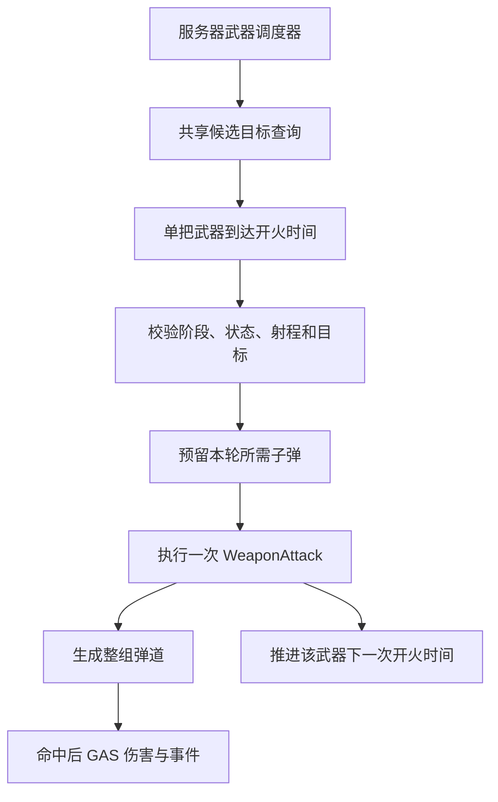

# Project Arcane Arena 多武器自动射击与限时生存重构方案

## 1. 文档职责与状态

- 状态：`Planned`。
- 创建／最后更新：2026-09-21。
- 源码分析基线：`develop`，HEAD `c48c4fc`。
- 目标方向：从手动技能驱动的竞技场战斗，逐步扩展为类似《土豆兄弟》的多武器自动攻击、密集敌群、限时生存和波间构筑；高密度 Projectile 作为独立新系统实现，现有 Fireball 等主动技能保持原路径，新系统直接使用 Data Projectile Pool、集中模拟、空间查询、批量表现和网络轻量化形成可量化优化闭环。
- 本文是设计与实施建议，不表示以下类型、功能、资产或性能收益已经存在。
- 默认保留 UE5 C++、GAS、服务器权威、两人 Listen Server 架构，以及顶视角／第三人称兼容。

配套文档：

- [COMBAT_POOLING_DESIGN.md](COMBAT_POOLING_DESIGN.md)：子弹与数字池、异步资源准备、分帧预热、容量和复制复用协议。
- [IMPLEMENTED_FEATURES.md](IMPLEMENTED_FEATURES.md)：全项目真实实现状态。
- [PENDING_VERIFICATION.md](PENDING_VERIFICATION.md)：进入实施后维护未完成的运行时验证。
- [BOSS_DEVELOPMENT_PLAN.md](BOSS_DEVELOPMENT_PLAN.md)：实际改变 Boss 范围或完成条件时同步维护。
- [INVENTORY_DEVELOPMENT_PLAN.md](INVENTORY_DEVELOPMENT_PLAN.md)：现有消耗品背包边界；未来若修改物品、拾取或背包接口，须同步维护。

阶段状态统一使用 `Planned`、`Partial`、`Implemented`、`Verified`。本次只记录方案并建立与对象池设计的关联，不修改玩法代码、项目资产或历史功能验收状态。

## 2. 玩法定位与推荐首版

### 2.1 目标体验

核心循环是：玩家移动与走位，多把武器独立寻找目标并持续输出，通过升级形成可辨认的构筑，在有限时间内应对敌群，然后进入波间成长。

参考《土豆兄弟》的多武器、自动攻击、限时波次和波间购买结构，不以逐项复刻原游戏的武器数量、数值或经济为首版目标。现有项目可以保留 Dash、Shield 等主动操作，形成自己的战斗节奏。

### 2.2 推荐的首个可玩范围

- 三种武器：单发、散射、穿透。
- 两个可同时工作的装备槽，槽位容量配置化，验证后再扩展至六槽。
- 三波限时生存，继续使用现有波后三选一。
- 保留 Dash 和 Shield 作为首版主动操作；其他现有技能保留为回归对象或后续配置项，不在第一阶段删除类和资产。
- 自动选敌为默认新路径；手动瞄准作为后续兼容选项。
- 对象池、分帧预热与最低性能统计接入。
- 保持双视角与服务器权威，完成两人 Listen Server 验证。

商店、材料、经验、武器合成、六槽完整平衡及集中弹道模拟属于后续阶段。先证明持续移动、自动攻击和波后成长形成可玩的闭环，再扩大系统范围。

## 3. 当前架构与保留／修改边界

| 系统 | 当前基础 | 重构方向 |
|---|---|---|
| GAS 持有关系 | PlayerState 持有 ASC 和 AttributeSet | 保留，武器永久装备也放 PlayerState Model |
| 伤害 | GE、ExecCalc、Shield 优先、暴击、死亡与事件 | 保留，补充稳定武器及攻击来源 |
| 手动技能 | 输入 Tag、双视角 TargetData、预测与 Commit | 保留原路径，新增自动武器入口 |
| Fireball／敌方子弹 | 服务端生成复制 Actor，命中或超时销毁 | 接入对象池，逐步抽取共用弹道与命中规则 |
| 波次 | 固定敌人列表、全部清空后完成 | 增加限时生存完成规则和持续刷新 |
| 构筑 | DataAsset、RequiredTags、BlockedTags、PlayerState 叠层 | 扩展到武器实例、武器类别和攻击模式 |
| 敌人 AI | 服务端低频决策，Character／寻路／攻击 Ability | 先优化调度和重复查询，测量后再评估普通怪轻量化 |
| 背包 | PlayerState Model、OwnerOnly FastArray、消耗品堆叠 | 保留；武器装备独立建模，不混成消耗品数量 |
| UI | HUD、升级、阶段和输入锁协调 | 增加武器槽、计时器，后续材料与商店 |

当前主要链路：

```text
手动输入 → ASC → BasicAttack / Fireball → TargetData → Commit → 权威命中或子弹
敌方远程动画释放 → ExecuteAttack → 复制子弹 → GE_Damage
WaveManager 固定刷新列表 → AliveEnemies 清空 → Upgrade / Victory
AttributeSet 实际损失 → ASC 批量反馈 → HitReaction → 本地数字
```

这次重构扩大玩法与调度范围，不绕过已有 GAS 伤害、事件和权限边界。

## 4. 武器定义、装备实例与职责

### 4.1 建议新增类型

以下类型名称均为建议，尚未实现。

| 类型 | 职责 |
|---|---|
| `UArenaWeaponDataAsset` | 武器静态配置、攻击模式、基础数值及资源 |
| `UArenaWeaponLoadoutComponent` | PlayerState 上的装备 Model，管理槽位、实例和服务器装备变更 |
| `FArenaWeaponInstance` | 单把武器的实例 ID、槽位、定义、品质及专属修正 |
| `UArenaAutoAttackComponent` | 服务器自动攻击调度；维护各武器开火时间、候选目标和发射请求 |
| `UArenaGameplayAbility_WeaponAttack` | 一轮武器攻击的校验与执行，接入 GAS 和子弹池 |
| `UArenaTargetingSubsystem` | World 级目标注册、共享候选集及空间查询 |

装备 Model 与临时攻击运行态分离：装备保留在 PlayerState；调度器可随当前 PlayerCharacter 创建，Avatar 更换时从 Model 重新建立运行态。调度器不保存永久武器所有权。

### 4.2 武器定义

```text
WeaponID / WeaponTags / Rarity
AttackInterval / Range
BaseDamage / DamageScaling
AttackPattern
ProjectileCount / SpreadAngle / BurstCount / BurstInterval
ProjectileSpeed / Lifetime
PierceCount / BounceCount
DamageTypeTag / DamageEffectClass
ProjectileClass / VisualConfig
```

优先使用 DataAsset、ScalableFloat、现有 GameplayTag 和 GE 配置，不在攻击逻辑中硬编码武器 ID。范围、扇形角度、数量和递归限制都必须在服务器验证配置合法性。

### 4.3 武器实例

```text
WeaponInstanceID
SlotIndex
WeaponDefinition
Level / Rarity
实例专属修正
```

两把相同武器可以引用同一份 DataAsset，但必须具有不同 `WeaponInstanceID`、槽位及独立调度状态。不得只按 WeaponID 或技能类查找当前正在开火的武器。

装备可采用 OwnerOnly FastArray 向所属玩家同步详细信息；其他玩家另收必要的公开槽位外观和攻击表现信息，不能因详细 Model 是 OwnerOnly 而缺失远端武器显示。

## 5. 自动攻击与 GAS 接入

### 5.1 新攻击路径



自动攻击不循环模拟按 Q，不为每颗子弹创建 `WaitTargetData`／TargetActor。服务器自动选敌；手动瞄准时客户端只提交必要的瞄准意图，再沿现有双视角路径进行权威验证。

### 5.2 调度与实例隔离

- 每把武器具有独立的 `NextFireTime`，同类武器不能因共享 `Cooldown.WeaponAttack` 而互相阻塞。
- 初版每轮攻击执行一次短生命周期 GA；一次散射属于一轮攻击，不按每颗子弹激活一次 GA。
- 使用明确的 AbilitySpecHandle、武器实例 ID 和本次攻击参数路由，不复用输入 Tag 查找全部同类 Ability。
- 选择与运行方式匹配的 Ability 实例策略，避免同一个可变 GA 实例被多个槽位覆盖。接口与实例生命周期在落地时一并验证。
- 调度器负责武器间隔及运行态；GE 继续负责属性和状态修改，不能直接扣 Health、Shield 或 Energy。
- 射速变化时，下一发时间的重算规则应唯一且可测试，不能同时由 Timer、Cooldown Tag 和另一套累计时间竞争控制。
- 卡顿后设置明确的补发上限与时间推进规则，不能在恢复的一帧无限补发过去所有攻击。
- 默认自动射击不依赖全身 Montage，不占用全局攻击锁阻止移动或其他槽位输出。
- 各武器表现独立朝向目标，不让多把武器轮流修改整个 Character 朝向。

需要资源消耗的武器仍通过 GAS Commit／Cost 处理；基础自动武器可以配置为无 Energy 消耗。子弹资源必须在提交前预留，失败时释放预留并遵守现有预测回滚协议。

### 5.3 选敌

- 候选查询可以从 5–10 Hz 作为实验起点，缓存短期目标；实际开火前重新校验存活、资格、射程及必要视线。
- 同一玩家多武器共享附近候选集，再按各自范围和规则选择，避免每帧每把武器遍历全世界敌人。
- 首版先通过注册目标集合减少重复查找；密集敌群阶段再接空间网格等局部查询结构。
- 缓存使用可校验的弱引用，敌人死亡或退出 World 时注销；位置缓存不能代替命中阶段的权威检测。
- 自动目标可不在当前屏幕中，但世界内的攻击资格必须一致；相机视角不决定伤害权威。

### 5.4 触发语义

当前 `UArenaAbilitySystemComponent::NotifyAbilityCommit` 会对带玩家主动技能分类的施放发送 `Trigger.OnAbilityCast`。高频自动武器不能直接继承此分类后无条件触发原有回能等被动。

建议区分：

| 事件或分类 | 语义 |
|---|---|
| `Trigger.OnAbilityCast` | 保留玩家主动技能施放 |
| 建议新增 `Trigger.OnWeaponFire` | 一轮成功武器攻击，散射多弹默认只计一次 |
| OnDamage / OnCrit / OnKill | 继续由实际权威伤害结果产生 |
| 武器攻击分类 Tag | 与现有 `Ability.Type.PlayerActive`／EnergySkill 明确区分 |

穿透、分裂和弹跳是否允许触发被动、按目标还是按一轮计数，应逐条写入升级规则；保留 Secondary 等递归保护。不能通过减少真正伤害或事件来实现表现节流。


## 6. 弹道模式、命中与高密度 Projectile

### 6.1 分层职责

```text
武器：什么时候攻击、使用哪些配置
攻击模式：一轮发射多少弹、方向及节奏
Projectile Simulation：飞行、寿命、碰撞候选、穿透／弹跳状态
Hit Command：把模拟结果带回主线程
命中效果：GE / ExecCalc / 状态与触发事件
视觉表现：Niagara / Impact / Trail，不拥有权威伤害
```

保留现有 Fireball 和敌方 Projectile 公开类，不直接删除或重命名。首版玩法只新增单发、散射、穿透；连射、弹跳、分裂在基础正确性通过后再扩展。

| 模式 | 核心规则 |
|---|---|
| 单发 | 单方向、单 Projectile |
| 散射 | 同轮多方向，一次 WeaponFire 语义 |
| 穿透 | 已命中目标集合、剩余穿透次数、首次命中顺序 |
| 连射，后续 | 独立释放节奏，阶段结束／取消时停止剩余释放 |
| 弹跳，后续 | 重新选目标、次数限制、避免立即重复命中 |
| 分裂，后续 | 子代数量与递归深度上限、继承来源和触发规则 |

### 6.2 单次攻击身份

- 每轮攻击分配 `AttackInstanceID`，每颗 Projectile 具有独立 `ProjectileID + Generation`。
- ID 用于伤害归属、命中去重、视觉映射、网络重建和调试，不使用 Actor 名字或数组下标作为长期身份。
- 来源 ASC、WeaponInstanceID 及攻击配置在发射时快照；旧伤害不读取已经被下一轮复用的 Projectile 当前状态。
- 穿透集合按本次发射维护；同目标重复碰撞默认不重复伤害，除非武器规则明确允许周期命中。
- 弹跳／分裂状态、延迟任务及命中集合在复用或释放时完整重置。

### 6.3 新弹幕系统与旧技能边界

自动射击重构采用独立 Projectile 系统，不把现有 Fireball／EnemyProjectile 作为技术基础：

```text
现有主动技能
Fireball / Lightning / 特殊敌方 Projectile
        ↓
Existing GAS Ability + Actor
        ↓
当前保持不动

新 Survivor 自动武器
        ↓
UArenaAutoAttackComponent
        ↓
UArenaProjectileSimulationSubsystem
        ↓
Data Projectile Pool
        ↓
Spatial Hash + Swept Collision
        ↓
HitCommand Buffer
        ↓
GAS
```

因此首版高密度弹幕**不先实现 Actor Projectile Pool**。Fireball 属于低频主动技能，一般不会产生足以主导帧时间的大量并发对象；如果未来 Unreal Insights 证明其 Spawn／Destroy 确实造成明显尖峰，再作为独立 Legacy Projectile Optimization 处理。

新系统中的对象池指预分配的数据槽位池，而不是 `AActor` 池。普通弹幕从第一版就不创建每发 `AActor`、CollisionComponent 或 ProjectileMovementComponent。

### 6.4 Data Projectile Pool 与集中模拟

建议新增 `UArenaProjectileSimulationSubsystem`，同时承担普通弹幕的数据池和集中模拟。

第一版预分配固定或可扩展槽位，例如压力测试容量 5000：

```text
FreeSlots
ActiveSlots
ProjectileID
Generation
```

武器发射时从 FreeSlots 取得槽位，写入 Projectile 数据；Projectile 命中、超时或退出世界时归还槽位。Generation 用于阻止旧视觉／网络／延迟回调误操作已经复用的槽位。

核心热数据优先采用连续存储，并在正确性稳定后评估数组结构（SoA）：

```text
Positions[]
PreviousPositions[]
Velocities[]
Radii[]
RemainingLife[]
PierceRemaining[]
ProjectileIDs[]
Generations[]
AttackInstanceIDs[]
```

来源 ASC、武器定义和完整伤害配置属于冷数据，通过稳定 Handle 查找，避免每帧大量 UObject 指针访问。

每帧逻辑：

```text
批量位置积分
→ 计算 PreviousPosition 到 CurrentPosition 的运动线段
→ Spatial Hash 查询局部目标
→ 连续扫掠窄相
→ 更新穿透／寿命
→ 生成 HitCommand
→ 释放结束 Projectile 槽位
→ GameThread 统一进入 GAS
```

### 6.5 Spatial Hash 与命中命令

密集场景不得以“每颗 Bullet 遍历所有 Enemy”作为最终实现。目标注册到世界 XY 网格；Projectile 只查询运动线段覆盖的 Cell 和邻近 Cell。

高速弹使用 `PreviousPosition → CurrentPosition` 的 Swept Segment，避免只检查当前位置造成穿透。CellSize、邻格范围和目标形状由压力测试决定。

模拟阶段不直接 `ApplyGameplayEffectSpecToTarget`，而生成 `FArenaProjectileHitCommand`。单线程版本也保持这一边界，为后续并行化和 GAS 主线程约束做准备。GameThread 重新验证 Source、Target、阶段与死亡状态，再构造 GE Spec。

### 6.6 表现与逻辑解耦

Data Projectile 不对应同数量的 Niagara Component。客户端由 `UArenaProjectileVisualSubsystem` 使用共享 Niagara System 表示大量普通弹体，命中事件优先通过 Niagara Data Channel（NDC）或等价批量接口提交。

```text
Server Projectile Logic
        │
        ├─ HitCommand → GAS
        │
        └─ Launch/Visual Params
                    ↓
Client Shared Niagara
                    ↓
Projectile / Trail / Impact
```

表现允许按距离、重要性和预算降低装饰特效，但不能改变服务器 Projectile 数量、碰撞或真实伤害。

### 6.7 MassEntity 边界

项目现有 Mass 示例继续作为学习和对照实现，不直接作为普通 Projectile 默认后端。当前 Projectile 数据规模和行为较单一，自定义 WorldSubsystem + 连续存储更容易控制 Handle、碰撞、GAS、网络和 Profiling。

只有同一压力场景证明 Mass 方案在复杂度可接受的前提下带来明确收益，才考虑迁移。不能因为项目已经启用 Mass 插件就把 ECS 作为设计前提。

### 6.8 网络边界

Actor Projectile 首版继续使用现有复制并配合池化。Data Projectile 不为每发建立长期网络 Actor，而按一轮攻击同步可重建参数：

```text
AttackInstanceID
WeaponInstanceID / VisualType
LaunchOrigin
BaseDirection
ProjectileCount
Pattern / SpreadAngle
Speed
Lifetime
RandomSeed
ServerLaunchTime
```

客户端用相同 Seed 和服务器时间重建表现轨迹；服务器仍独占碰撞和伤害。权威终止、命中表现或必要校正采用有界事件／状态补偿，不逐发发送可靠开火 RPC。

已经命中的伤害不进入跨帧“性能队列”。分帧预算只用于资源准备、表现和可延迟的扩容工作，不能偷偷改变命中结算语义。

## 7. 限时波次与统一战斗收尾

### 7.1 波次数据

建议扩展 `FArenaWaveConfig`：

```text
CompletionRule：ClearAll / SurviveDuration / DefeatBoss
Duration
SpawnRateCurve
MaxAliveEnemies
EnemyComposition
SpawnBudgetPerFrame
```

保留 `ClearAll` 兼容现有测试与资产。普通新波次使用 `SurviveDuration`，Boss 首版继续使用击杀完成规则，不同时重做 Boss AI 和演出。

```text
限时 Combat
→ 按时间推进持续刷新
→ 到达服务器截止时间
→ 停止战斗、处理残留
→ Upgrade，后续可进入 Shop
→ 所有需要参与的玩家完成选择／准备
→ 下一波
```

GameMode／WaveManager 管理权威刷新和完成条件，GameState 复制结束服务器时间及阶段；HUD 本地计算倒计时，不每帧复制剩余秒数。

刷新速率与每帧创建预算分别表示玩法密度和执行预算。达到活跃敌人上限或创建预算时，明确跳过／延后规则，不无限积压待生成敌人，也不在波末突然补出全部欠额。

### 7.2 结束波次不等于杀死所有敌人

当前 `CheckWaveCompletion` 要求存活列表清空；限时结束时则可能存在敌人、子弹、Burning 和区域伤害，必须增加统一权威收尾。

1. 幂等地关闭本波战斗权限并固定完成原因。
2. 停止刷新、自动调度、敌人攻击和未释放连射。
3. 释放未消费预留，回收本波子弹，处理残留区域和持续效果。
4. 使用明确的场景清理原因移除敌人，不走正常击杀奖励流程。
5. 完成统计与必要掉落结算，再进入升级／商店。

伤害入口、武器调度和敌人攻击应共享阶段许可，防止只有 UI 停火而服务器 Burning 继续扣血。正常 Combat 内的受击、无敌和死亡仍由现有 GAS 规则处理。

场景清理不得触发 OnKill、击杀掉落、吸血／回血奖励或击杀统计。玩家死亡与时间到达同帧时的优先级需固定：建议终局死亡优先，并在实际阶段提交前再次核对存活玩家，禁止迟到回调把 Defeat 覆盖为 Upgrade。

当前 AI 的停止条件不能视为已经覆盖新 Shop／波末阶段，必须实际修改并回归。Boss 波、Intro／Outro 和召唤物继续按 Boss 规划处理；涉及其完成条件变动时同步对应文档。

## 8. 构筑、成长、掉落与商店

### 8.1 先适配三选一

复用 `UArenaUpgradeDataAsset` 的资格、品质、Tag 和叠层框架，扩展作用域：

- 全局角色属性，通过 GE 修改。
- 所有武器的公共修正。
- 指定武器类别或元素的修正。
- 指定装备实例的修正。
- 穿透、弹跳、散射等规则升级。

升级规则优先按 WeaponTags／DamageTypeTag 等数据路由，不堆积 WeaponID 分支。武器专属状态放装备实例，永久构筑状态仍归 PlayerState。明确射速、攻击倍率、数量和范围的叠加方式，避免同一增益在调度器、子弹和 ExecCalc 中重复乘算。

### 8.2 材料与经验，后续阶段

材料、经验和等级属于运行内成长状态，由 PlayerState 上的服务器组件管理。材料不是必须做成 GAS Attribute；获得属性奖励时仍通过 GE 修改战斗属性。

密集掉落优先评估数据记录、空间查询与本地表现，或独立轻量池，避免每次击杀生成多个完整复制 Pickup Actor。吸附可以是表现，但拾取距离、资格、归属和奖励由服务器确认。

两人模式必须先明确材料独享还是共享，未确定前不实现奖励分配。不得让客户端吸附到屏幕就直接增加服务器余额。

### 8.3 商店，后续阶段

功能范围逐步增加购买、出售、刷新、升级／合成和 Ready。服务器拥有商品、价格与结果，客户端只提交意图。

交易应验证商品 ID、报价版本、余额、阶段、槽位和材料，以不可重入的事务完成扣费及装备变更。失败不产生半笔交易；重复请求不能重复扣费或重复授予。

武器装备不复用消耗品堆叠 Model。可借鉴现有 MVC、OwnerOnly FastArray 和 PlayerController RPC，但不让 UI 拥有材料、装备或商品权威状态。

多人商店应处理断线、死亡玩家资格和全员 Ready 条件，不能简单等待一个永远不会提交的玩家。正式落地这些规则时再扩展 GamePhase、Controller 输入锁和对应验证文档。


## 9. 敌群与性能路线

性能优化采用“先测量、再逐层替换”的固定路线，不把所有卡顿归因于对象池或敌人数量。

### 9.1 Projectile 性能演进

新弹幕系统不经过“先优化旧 Fireball Actor Pool”这一步。传统 Actor Projectile 只作为成本参考：

```text
P0 Legacy Actor Reference / 独立 Stress Test
确认传统 AActor + Movement + Collision + Replication 成本
        ↓
P1 Data Projectile Pool
预分配槽位 + SoA + Free List + Generation + 集中移动
        ↓
P2 Auto Weapon 接入
第一把基础自动武器直接向 Data Pool 发射；与 G-A 是同一实现节点
        ↓
P3 Spatial Hash + Swept Collision
降低 Projectile × Enemy 全遍历和通用碰撞查询，并输出 HitCommand
        ↓
P4 Spread / Pierce / 多武器
验证 AttackInstanceID、穿透去重和多个 WeaponRuntime 隔离
        ↓
P5 Shared Niagara / NDC
降低大量独立粒子 System Instance 和命中特效实例
        ↓
P6 Launch Reconstruction / 轻量网络
降低逐弹 ReplicateMovement 和网络 Actor 数
        ↓
P7 Parallel Simulation + 综合规模化验收
仅在 Insights 证明需要时按 Chunk 并行，并完成真实敌群 + GAS + VFX + 网络 + 长时间运行验收
```

Legacy Actor Reference 可以使用独立 Benchmark 模式，不要求修改正式 Fireball。这样性能故事更干净：传统 Actor 成本作为参照，新 Data Projectile 系统从零构建并逐层优化。

### 9.2 敌群优化顺序

敌人 CharacterMovement、寻路、碰撞、骨骼动画、ASC、反馈和网络复制独立采样，建议依次处理：

1. 打散低频 AI 决策时点，减少同帧尖峰。
2. 降低重复 MoveTo、目标遍历和视线检测，复用候选查询。
3. 自动武器和敌人 AI 尽量共享目标注册／空间查询基础，不各自遍历全世界。
4. 限制远处普通怪动画、血条和装饰效果更新成本。
5. 控制粒子、拖尾和灯光；保留敌方攻击可读性。
6. 数字池、集中更新、显示预算与可选 HUD 单层按性能文档执行。
7. 依据证据评估普通杂兵轻量移动或 Mass；精英／Boss 优先保留现有完整 Character/GAS 结构。

项目现有 Mass 视觉集群只用于实验表现，不能直接作为拥有权威碰撞、GAS、死亡奖励和完整 AI 的敌群替代。

### 9.3 压力量级与容量估算

```text
总发射率 ≈ 玩家数 × Σ(每把武器每秒攻击次数 × 每轮弹数) + 敌方发射
活跃弹量 ≈ 总发射率 × 平均有效飞行时间
```

基础 Projectile-only 压测至少覆盖：

```text
100 / 250 / 500 / 1000 / 2000 / 5000
```

综合验收重点覆盖 `1000–2000` 活跃普通弹体、`100–200` 普通敌人的目标区间，并开启真实 GAS 命中、伤害反馈和客户端表现。这里是开发目标，不是当前已实现性能结论。

分裂、连射和弹跳会增加实际负载，必须单独计入。配置硬上限、递归限制和有界队列；不通过暗中少发 Projectile、漏算伤害或隐藏必要敌方弹体冒充性能提升。

## 10. 双视角、联网与 UI

- 自动目标查询与相机模式分离；两种视角使用相同攻击规则。
- 手动模式分别读取顶视角鼠标和第三人称中心射线，第三人称继续忽略自身 Avatar。
- 客户端只提交瞄准意图、购买或装备操作，不逐发发送可靠开火 RPC。
- 服务器调度自动攻击并决定真实子弹；客户端负责枪口、武器朝向、音频、拖尾和数字。
- 武器朝向和枪口表现应可从发射信息恢复，不要求复制每个武器组件的每帧 Transform。
- 死亡、复活和更换 Pawn 时，装备 Model 保留；调度器取消旧运行态和回调，再绑定新 Avatar。
- HUD 增加武器槽、等级和波次倒计时；材料、经验、商店随对应阶段接入。
- Upgrade／Shop 继续使用统一输入锁协调，关闭一个窗口不能意外解除其他阶段的控制锁。
- Dedicated Server 不创建 UI、数字和客户端 VFX；不同客户端可以采用不同表现预算，权威结果不变。


## 11. 具体修改地图

| 位置 | 修改内容 |
|---|---|
| [ArenaPlayerState.h](Source/ProjectArcaneArena/Public/Core/ArenaPlayerState.h) | 创建武器装备 Model，保留永久构筑与现有 ASC 所有权 |
| [ArenaGameplayAbility_BasicAttack.cpp](Source/ProjectArcaneArena/Private/GAS/ArenaGameplayAbility_BasicAttack.cpp) | 保留手动入口，不把原动画／输入生命周期直接复制到自动武器 |
| [ArenaAbilitySystemComponent.cpp](Source/ProjectArcaneArena/Private/GAS/ArenaAbilitySystemComponent.cpp) 或独立 Resolver | 区分 WeaponFire 与主动施放事件；主线程消费 Projectile HitCommand 并接入现有 GAS |
| [ArenaWaveDataAsset.h](Source/ProjectArcaneArena/Public/Core/ArenaWaveDataAsset.h) | 增加完成规则、时间、密度曲线和活跃上限 |
| [ArenaWaveManager.cpp](Source/ProjectArcaneArena/Private/Core/ArenaWaveManager.cpp) | 限时刷新、完成判定、Data Projectile 清理、无击杀奖励的收尾与幂等保护 |
| [ArenaGameMode.cpp](Source/ProjectArcaneArena/Private/Core/ArenaGameMode.cpp) | 成长阶段推进、多人完成条件，后续商店权威规则 |
| [ArenaGameState.h](Source/ProjectArcaneArena/Public/Core/ArenaGameState.h) | 复制截止时间、必要新阶段与统一战斗许可 |
| [ArenaEnemyAIController.cpp](Source/ProjectArcaneArena/Private/AI/ArenaEnemyAIController.cpp) | 阶段停火、调度错峰、减少重复查询 |
| [ArenaUpgradeDataAsset.h](Source/ProjectArcaneArena/Public/Core/ArenaUpgradeDataAsset.h) | 定义武器升级作用域和兼容数据路由 |
| [ArenaBalanceTelemetryComponent.cpp](Source/ProjectArcaneArena/Private/Core/ArenaBalanceTelemetryComponent.cpp) | 区分武器攻击、主动施放、真正击杀和波末清理 |
| 新增 `ArenaWeaponDataAsset.*` | 武器静态定义、攻击模式、Projectile 参数和视觉类型 |
| 新增 `ArenaWeaponLoadoutComponent.*` | PlayerState 装备 Model、槽位和 WeaponInstanceID |
| 新增 `ArenaAutoAttackComponent.*` | 服务端自动攻击调度、NextFireTime 和目标缓存 |
| 新增 `ArenaTargetingSubsystem.*` | 共享目标注册和自动选敌候选查询 |
| 新增 `ArenaProjectileTypes.*` | ProjectileHandle、SpawnParams、HitCommand 等纯数据协议 |
| 新增 `ArenaProjectileSimulationSubsystem.*` | Data Projectile Pool、Free List、Generation、集中移动和寿命 |
| 新增 `ArenaProjectileSpatialGrid.*` | 目标 Cell 注册、局部候选与 Swept Collision 宽相 |
| 新增 `ArenaProjectileVisualSubsystem.*` | 客户端 Shared Niagara / NDC 弹体与命中特效 |
| 新增 `ArenaProjectileStressTestActor.*` | 可重复的 100～5000 Projectile 性能压力入口 |

首版不把 `ArenaGameplayAbility_Fireball.cpp`、`ArenaFireballProjectile.cpp`、`ArenaEnemyProjectile.cpp` 列为修改目标。新增武器 DataAsset、视觉资产和测试 WaveData 通过独立、幂等的资产脚本创建；不直接批量覆写当前正式波次和既有技能资产。

## 12. 实施阶段、依赖与当前进度

为避免玩法功能与性能工程互相阻塞，后续按两条轨道推进，并在关键节点合并验收。

### 12.1 玩法轨

| 阶段 | 状态 | 交付 | 验收门槛 |
|---|---|---|---|
| G-A：单武器自动攻击 | Implemented | `UArenaAutoAttackComponent` 服务器 Timer 选敌与调度，沿用现有波次并直接接入 Data Pool | 已验证移动射击、范围门控、死亡停火/目标切换、Upgrade/Combat 恢复及两人 Listen Server；Stun 与 Avatar 更换待补 |
| G-B：独立装备槽 | Planned | 先两槽、容量可扩展至六槽 | 同类武器的时间、来源、参数与状态独立 |
| G-C：三种攻击模式 | Planned | 单发、散射、穿透；稳定 AttackInstanceID | 穿透不重复命中，散射一轮只触发一次 WeaponFire |
| G-D：限时生存 | Planned | 三波限时刷新、统一阶段收尾 | 时间结束无残留伤害、无假击杀和迟到回调覆盖阶段 |
| G-E：武器构筑 | Planned | 适配现有三选一，明确作用域与触发频率 | 属性和实例修正不重复计算 |
| G-F：经济与商店 | Planned | 材料、经验及商店分步接入 | 权威交易完整，多人准备与异常退出正确 |

### 12.2 性能轨

| 阶段 | 状态 | 交付 | 验收门槛 |
|---|---|---|---|
| P0：独立基线压测 | Partial | StressTestActor；Legacy Actor Reference 与 Data 空载基线；100～5000 阶梯 | 能拆分传统 Actor/Movement/Collision/VFX/Network 成本，并建立新系统起点 |
| P1：Data Projectile Pool | Partial | SimulationSubsystem、预分配槽位、SoA、Free List、Handle、Generation、直线移动 | 普通 Projectile 不依赖每发 Actor/MovementComponent；复用无串状态 |
| P2：Auto Weapon 接入 | Implemented | 与 G-A 共用同一实现节点；`UArenaAutoAttackComponent` 直接向 Data Pool 发射并携带 AttackInstanceID | 已验证移动射击、范围/阶段/死亡门控、死亡目标切换与两人 Listen Server 独立发射；Stun、Avatar 更换和完整回归待补 |
| P3：Spatial Hash Collision | Partial | Enemy 注册、Spatial Hash Cell 查询、Previous→Current Swept Collision、HitCommand Buffer 与现有 GAS Damage Pipeline | 已确认命中/GAS、击杀/目标切换与 `ProjectileSpeed=10000` 高速 Swept Collision；待沿线最早目标和多人 Source 归属 |
| P4：Spread / Pierce / 多武器 | Planned | 散射、穿透、多个独立 WeaponRuntime | 同类武器互不覆盖；AttackInstanceID 稳定；穿透去重正确 |
| P5：批量表现 | Planned | VisualSubsystem、Shared Niagara、NDC Impact | 大量弹体不创建同数量 Niagara Component |
| P6：轻量网络 | Planned | Launch Params + Seed + ServerTime 重建 | 高密度普通弹不逐弹 ReplicateMovement |
| P7：并行与综合验收 | Planned | 仅在 Insights 证明需要时 Chunk 并行；真实自动武器、敌群、GAS、数字、VFX、网络和长时间运行 | 线程安全；帧时间、带宽、内存、槽位容量稳定；形成真实前后对照 |

P0/P1 已进入源码实现：独立压力 Actor、Legacy Actor 参考和 Data Projectile Pool 已存在，并已通过 ProjectArcaneArenaEditor 窄目标 UBT 编译与链接。5000 Active 的 DataPool 已取得稳定 PIE/Insights 基线（`ArenaProjectileSimulation` 约 0.041 ms/frame），LegacyActor M0/M1 已完成首轮对照；完整阶梯、Collision/Replication、Generation 专项与 Listen Server 验收仍待补，因此 P0/P1 保持 `Partial`。P2 / G-A 已进入源码实现：`UArenaAutoAttackComponent` 已挂入 `AArenaPlayerCharacter`，仅 Authority 使用 Timer 在 Combat 中寻找最近存活敌人并向 Data Pool 发射；当前不含碰撞/伤害/表现，且尚未完成 UBT/PIE，因此保持 `Partial`。\n\n旧 Fireball／EnemyProjectile Actor Pool 不属于性能轨前置阶段；未来若确有必要，单独作为 Legacy Projectile Optimization。

### 12.3 合并顺序

推荐开发顺序：

```text
P0
→ P1 Data Projectile Pool
→ P2 / G-A 单武器自动攻击（同一实现节点）
→ P3 Spatial Hash + Swept Collision
→ P4 / G-B / G-C 多槽、散射、穿透与多武器
→ G-D / G-E 限时生存与构筑
→ P5 / P6 批量表现与轻量网络
→ G-F（商店可后置）
→ P7 并行（仅按证据需要）+ 综合验收
```

关键依赖：

- P0 先建立传统 Actor Reference 和新系统压力场景，不修改正式 Fireball。
- P1 是 P2/G-A 的技术基础；第一把自动武器直接向 Data Projectile Pool 发射。
- P2 与 G-A 是同一实现节点：玩法轨关注自动攻击规则，性能轨关注 Data Projectile 接入与基线延续，不重复建设两套系统。
- P3 的 HitCommand 是 Projectile Simulation 与 GAS 的唯一高频结算边界。
- P4 与 G-B/G-C 对齐；散射／穿透／多武器统一使用稳定 `AttackInstanceID + ProjectileID + Generation`。
- G-D 波末统一清理 Data Projectile Active Slots 和未完成自动攻击调度。
- G-E 升级数据依赖 WeaponInstanceID 和统一 WeaponFire／Hit 语义。
- P5/P6 只改变表现和传输方式，不改变服务器 GAS 权威。
- P7 的 Chunk 并行仅在 Unreal Insights 证明单线程 Projectile Simulation 成为主要瓶颈时启用；综合验收无论是否并行都必须完成。
- 旧主动技能只做回归，不因新弹幕架构被强制重写。

当前实现进度：P0/P1 为 `Partial`，已有源码、编译、PIE 与首轮 Unreal Insights 证据；P2 / G-A 为 `Implemented`；P3 已进入源码实现并完成 Spatial Hash、Swept Collision、HitCommand 与 GAS 结算接线，但尚未 UBT/PIE，状态为 `Partial`；P4～P7 与 G-B～G-F 仍为 `Planned`。

## 13. 验证方案

### 13.1 正确性

- 同一玩家装备两把相同武器，交错开火，无共享冷却、参数覆盖和来源混淆。
- 两名玩家同时使用散射与穿透，同一发对子目标的伤害次数符合规则。
- 升级射速、伤害和穿透后，仅作用到声明范围，不重复计算。
- 一轮散射仅产生一次 WeaponFire；OnCrit／OnKill 仍根据实际目标结算。
- Data Pool 耗尽必须记录 Overflow；Stun、死亡、换 Pawn 和阶段结束停止新发射并正确释放已有 Projectile 槽位。
- 时间到达与全员死亡竞争时，阶段只提交一次，终局不被迟到回调覆盖。
- 波末清理不授予击杀奖励、不增加击杀统计、不新增掉落。
- 未来商店重复请求、失效报价、余额不足或满槽时，交易不会部分完成。

### 13.2 视角与网络

- 顶视角与第三人称分别验证自动攻击、移动、Dash、Shield 和已有主动技能回归。
- 发射、穿透、连射等待或数字淡出时切视角，不生成重复对象或伤害。
- 两人 Listen Server 使用独立视角和装备，远端武器外观与真实发射一致。
- `150ms RTT + 2% / 5% Packet Loss` 下验证快速复用、预测拒绝、阶段切换及目标销毁。
- Dedicated Server 无本地表现开销，断线与重生不保留旧调度器回调。
- Standalone 与 Packaged Build 冷启动检查新增资产收录和预热，不能只依赖编辑器热缓存。


### 13.3 性能与证据

每次测试固定玩家数、武器配置、敌人数、每秒发射数、平均寿命、伤害触发率、视角、分辨率、随机种子和特效档位。

Projectile-only 基线至少覆盖：

```text
100 / 250 / 500 / 1000 / 2000 / 5000 active projectiles
```

每一级分别测试：

```text
Actor/Data only
+ Movement
+ Collision
+ Visual
+ Network
+ Real GAS Hit
```

必须记录：

- Average、P95、P99 和最大帧时间尖峰。
- GameThread、RenderThread、GPU。
- GC 次数／暂停、Actor 与 Component 数量。
- Projectile Simulation 时间、SpatialGrid 候选数、实际窄相次数和 HitCommand 数量。
- Data Pool Active/Free 槽位、PeakActive、OverflowCount、Generation 错配丢弃数和扩容次数。
- Niagara System Instance 数量。
- 网络吞吐、复制 Actor 数量和每秒攻击事件。
- 长时间运行后的内存平台、待处理发射／命中／数字队列长度。

综合目标场景以固定 1920×1080 配置下 `1000–2000` 活跃普通 Projectile、`100–200` 普通敌人、持续自动攻击、真实 GAS Damage、伤害数字和客户端 VFX 为主要验收区间。开发目标是平均帧时间不高于 16.67ms，并重点控制 P95/P99；Projectile Simulation 本体争取在 1–2ms 量级。该数值属于目标，必须经 P0 校准，未实测前不得写成已经达到的简历成果。

Legacy Actor Reference、Data Projectile Pool、Spatial Hash、Shared Niagara、Network Reconstruction 和可选 Parallel Simulation 都使用同一压力场景形成版本矩阵。最终简历只引用真实保存的测试环境和结果，不以主观“不卡顿”替代数据。

## 14. 工程与文档约束

- 本文描述设计方向；具体实现只在对应任务进入实施时进行，保持小步可审查变更。
- 先保留原手动技能和正式资产作为回归基线，在独立测试配置验证新模式，避免一次性替换后无法定位退化。
- 不直接修改引擎源码，不引入未经批准的第三方插件，不提前建设复杂 ECS 或无限组合框架。
- 代码检查包括 includes、反射、GC 引用、复制字段、GAS 来源、阶段权限与回调生命周期；必要测试覆盖实例隔离、整组预留、穿透去重和阶段竞争。
- 构建遵守 `AGENTS.md` 的源码引擎与 Live Coding 安全规则，不执行全解决方案重建或宽泛构建参数。
- 新增功能实际完成后更新 `IMPLEMENTED_FEATURES.md`，待验收项写入 `PENDING_VERIFICATION.md`，本文同步阶段进度。
- 实际改变背包／Pickup 或 Boss 职责、公开接口、阶段规则时，同步相应开发计划；本次文档不改变其已实现状态。

## 15. 参考

- [Brotato 官方 Steam 商店介绍](https://store.steampowered.com/app/1942280/Brotato/)：多武器、自动攻击、限时波次和波间商店的玩法参考；本文并非其源码或内部架构分析。
- [子弹与伤害数字对象池设计](COMBAT_POOLING_DESIGN.md)：本项目资源与生命周期基础方案。
