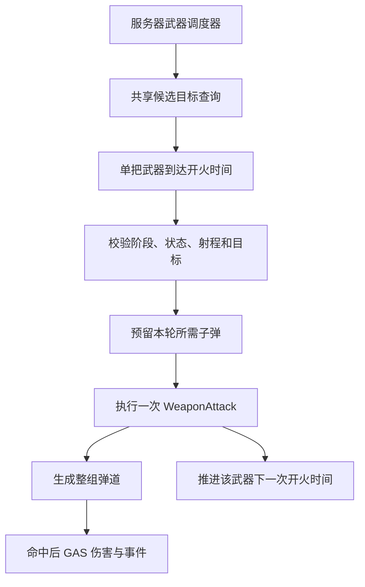

# Project Arcane Arena 多武器自动射击与限时生存重构方案

## 1. 文档职责与状态

- 状态：`Planned`。
- 创建／最后更新：2026-09-21。
- 源码分析基线：`feature/pcg-learning-lab`，HEAD `9d2032f`。
- 目标方向：从手动技能驱动的竞技场战斗，逐步扩展为类似《土豆兄弟》的多武器自动攻击、密集敌群、限时生存和波间构筑。
- 本文是设计与实施建议，不表示以下类型、功能、资产或性能收益已经存在。
- 默认保留 UE5 C++、GAS、服务器权威、两人 Listen Server 架构，以及顶视角／第三人称兼容。

配套文档：

- [COMBAT_POOLING_DESIGN.md](COMBAT_POOLING_DESIGN.md)：子弹与数字池、异步资源准备、分帧预热、容量和复制复用协议。
- [IMPLEMENTED_FEATURES.md](IMPLEMENTED_FEATURES.md)：全项目真实实现状态。
- [PENDING_VERIFICATION.md](PENDING_VERIFICATION.md)：进入实施后维护未完成的运行时验证。
- [BOSS_DEVELOPMENT_PLAN.md](BOSS_DEVELOPMENT_PLAN.md)：实际改变 Boss 范围或完成条件时同步维护。
- [INVENTORY_DEVELOPMENT_PLAN.md](INVENTORY_DEVELOPMENT_PLAN.md)：现有消耗品背包边界；未来若修改物品、拾取或背包接口，须同步维护。

阶段状态统一使用 `Planned`、`Partial`、`Implemented`、`Verified`。本次只记录方案并建立与对象池设计的关联，不修改玩法代码、项目资产或历史功能验收状态。

## 2. 玩法定位与推荐首版

### 2.1 目标体验

核心循环是：玩家移动与走位，多把武器独立寻找目标并持续输出，通过升级形成可辨认的构筑，在有限时间内应对敌群，然后进入波间成长。

参考《土豆兄弟》的多武器、自动攻击、限时波次和波间购买结构，不以逐项复刻原游戏的武器数量、数值或经济为首版目标。现有项目可以保留 Dash、Shield 等主动操作，形成自己的战斗节奏。

### 2.2 推荐的首个可玩范围

- 三种武器：单发、散射、穿透。
- 两个可同时工作的装备槽，槽位容量配置化，验证后再扩展至六槽。
- 三波限时生存，继续使用现有波后三选一。
- 保留 Dash 和 Shield 作为首版主动操作；其他现有技能保留为回归对象或后续配置项，不在第一阶段删除类和资产。
- 自动选敌为默认新路径；手动瞄准作为后续兼容选项。
- 对象池、分帧预热与最低性能统计接入。
- 保持双视角与服务器权威，完成两人 Listen Server 验证。

商店、材料、经验、武器合成、六槽完整平衡及集中弹道模拟属于后续阶段。先证明持续移动、自动攻击和波后成长形成可玩的闭环，再扩大系统范围。

## 3. 当前架构与保留／修改边界

| 系统 | 当前基础 | 重构方向 |
|---|---|---|
| GAS 持有关系 | PlayerState 持有 ASC 和 AttributeSet | 保留，武器永久装备也放 PlayerState Model |
| 伤害 | GE、ExecCalc、Shield 优先、暴击、死亡与事件 | 保留，补充稳定武器及攻击来源 |
| 手动技能 | 输入 Tag、双视角 TargetData、预测与 Commit | 保留原路径，新增自动武器入口 |
| Fireball／敌方子弹 | 服务端生成复制 Actor，命中或超时销毁 | 接入对象池，逐步抽取共用弹道与命中规则 |
| 波次 | 固定敌人列表、全部清空后完成 | 增加限时生存完成规则和持续刷新 |
| 构筑 | DataAsset、RequiredTags、BlockedTags、PlayerState 叠层 | 扩展到武器实例、武器类别和攻击模式 |
| 敌人 AI | 服务端低频决策，Character／寻路／攻击 Ability | 先优化调度和重复查询，测量后再评估普通怪轻量化 |
| 背包 | PlayerState Model、OwnerOnly FastArray、消耗品堆叠 | 保留；武器装备独立建模，不混成消耗品数量 |
| UI | HUD、升级、阶段和输入锁协调 | 增加武器槽、计时器，后续材料与商店 |

当前主要链路：

```text
手动输入 → ASC → BasicAttack / Fireball → TargetData → Commit → 权威命中或子弹
敌方远程动画释放 → ExecuteAttack → 复制子弹 → GE_Damage
WaveManager 固定刷新列表 → AliveEnemies 清空 → Upgrade / Victory
AttributeSet 实际损失 → ASC 批量反馈 → HitReaction → 本地数字
```

这次重构扩大玩法与调度范围，不绕过已有 GAS 伤害、事件和权限边界。

## 4. 武器定义、装备实例与职责

### 4.1 建议新增类型

以下类型名称均为建议，尚未实现。

| 类型 | 职责 |
|---|---|
| `UArenaWeaponDataAsset` | 武器静态配置、攻击模式、基础数值及资源 |
| `UArenaWeaponLoadoutComponent` | PlayerState 上的装备 Model，管理槽位、实例和服务器装备变更 |
| `FArenaWeaponInstance` | 单把武器的实例 ID、槽位、定义、品质及专属修正 |
| `UArenaAutoAttackComponent` | 服务器自动攻击调度；维护各武器开火时间、候选目标和发射请求 |
| `UArenaGameplayAbility_WeaponAttack` | 一轮武器攻击的校验与执行，接入 GAS 和子弹池 |
| `UArenaTargetingSubsystem` | World 级目标注册、共享候选集及空间查询 |

装备 Model 与临时攻击运行态分离：装备保留在 PlayerState；调度器可随当前 PlayerCharacter 创建，Avatar 更换时从 Model 重新建立运行态。调度器不保存永久武器所有权。

### 4.2 武器定义

```text
WeaponID / WeaponTags / Rarity
AttackInterval / Range
BaseDamage / DamageScaling
AttackPattern
ProjectileCount / SpreadAngle / BurstCount / BurstInterval
ProjectileSpeed / Lifetime
PierceCount / BounceCount
DamageTypeTag / DamageEffectClass
ProjectileClass / VisualConfig
```

优先使用 DataAsset、ScalableFloat、现有 GameplayTag 和 GE 配置，不在攻击逻辑中硬编码武器 ID。范围、扇形角度、数量和递归限制都必须在服务器验证配置合法性。

### 4.3 武器实例

```text
WeaponInstanceID
SlotIndex
WeaponDefinition
Level / Rarity
实例专属修正
```

两把相同武器可以引用同一份 DataAsset，但必须具有不同 `WeaponInstanceID`、槽位及独立调度状态。不得只按 WeaponID 或技能类查找当前正在开火的武器。

装备可采用 OwnerOnly FastArray 向所属玩家同步详细信息；其他玩家另收必要的公开槽位外观和攻击表现信息，不能因详细 Model 是 OwnerOnly 而缺失远端武器显示。

## 5. 自动攻击与 GAS 接入

### 5.1 新攻击路径



自动攻击不循环模拟按 Q，不为每颗子弹创建 `WaitTargetData`／TargetActor。服务器自动选敌；手动瞄准时客户端只提交必要的瞄准意图，再沿现有双视角路径进行权威验证。

### 5.2 调度与实例隔离

- 每把武器具有独立的 `NextFireTime`，同类武器不能因共享 `Cooldown.WeaponAttack` 而互相阻塞。
- 初版每轮攻击执行一次短生命周期 GA；一次散射属于一轮攻击，不按每颗子弹激活一次 GA。
- 使用明确的 AbilitySpecHandle、武器实例 ID 和本次攻击参数路由，不复用输入 Tag 查找全部同类 Ability。
- 选择与运行方式匹配的 Ability 实例策略，避免同一个可变 GA 实例被多个槽位覆盖。接口与实例生命周期在落地时一并验证。
- 调度器负责武器间隔及运行态；GE 继续负责属性和状态修改，不能直接扣 Health、Shield 或 Energy。
- 射速变化时，下一发时间的重算规则应唯一且可测试，不能同时由 Timer、Cooldown Tag 和另一套累计时间竞争控制。
- 卡顿后设置明确的补发上限与时间推进规则，不能在恢复的一帧无限补发过去所有攻击。
- 默认自动射击不依赖全身 Montage，不占用全局攻击锁阻止移动或其他槽位输出。
- 各武器表现独立朝向目标，不让多把武器轮流修改整个 Character 朝向。

需要资源消耗的武器仍通过 GAS Commit／Cost 处理；基础自动武器可以配置为无 Energy 消耗。子弹资源必须在提交前预留，失败时释放预留并遵守现有预测回滚协议。

### 5.3 选敌

- 候选查询可以从 5–10 Hz 作为实验起点，缓存短期目标；实际开火前重新校验存活、资格、射程及必要视线。
- 同一玩家多武器共享附近候选集，再按各自范围和规则选择，避免每帧每把武器遍历全世界敌人。
- 首版先通过注册目标集合减少重复查找；密集敌群阶段再接空间网格等局部查询结构。
- 缓存使用可校验的弱引用，敌人死亡或退出 World 时注销；位置缓存不能代替命中阶段的权威检测。
- 自动目标可不在当前屏幕中，但世界内的攻击资格必须一致；相机视角不决定伤害权威。

### 5.4 触发语义

当前 `UArenaAbilitySystemComponent::NotifyAbilityCommit` 会对带玩家主动技能分类的施放发送 `Trigger.OnAbilityCast`。高频自动武器不能直接继承此分类后无条件触发原有回能等被动。

建议区分：

| 事件或分类 | 语义 |
|---|---|
| `Trigger.OnAbilityCast` | 保留玩家主动技能施放 |
| 建议新增 `Trigger.OnWeaponFire` | 一轮成功武器攻击，散射多弹默认只计一次 |
| OnDamage / OnCrit / OnKill | 继续由实际权威伤害结果产生 |
| 武器攻击分类 Tag | 与现有 `Ability.Type.PlayerActive`／EnergySkill 明确区分 |

穿透、分裂和弹跳是否允许触发被动、按目标还是按一轮计数，应逐条写入升级规则；保留 Secondary 等递归保护。不能通过减少真正伤害或事件来实现表现节流。

## 6. 弹道模式、命中与对象池

### 6.1 分层职责

```text
武器：什么时候攻击、使用哪些配置
攻击模式：一轮发射多少弹、方向及节奏
子弹：飞行、碰撞、穿透／弹跳状态、回收
命中效果：GE / ExecCalc / 状态与触发事件
```

保留现有 Fireball 和敌方子弹公开类，逐步抽取共用能力，不直接删除或重命名。首版只新增单发、散射、穿透；连射、弹跳、分裂在基础正确性通过后再扩展。

| 模式 | 核心规则 |
|---|---|
| 单发 | 单方向、单子弹 |
| 散射 | 同轮多方向，整组预留后发射 |
| 穿透 | 已命中目标集合、剩余穿透次数、首次命中顺序 |
| 连射，后续 | 独立释放节奏，阶段结束／取消时停止剩余释放并释放预留 |
| 弹跳，后续 | 重新选目标、次数限制、避免立即重复命中 |
| 分裂，后续 | 子代数量与递归深度上限、继承的来源和触发规则 |

### 6.2 单次攻击身份

- 每轮攻击分配 `AttackInstanceID`，每颗子弹拥有独立 ID／Generation。
- ID 用于伤害归属、命中去重、回调隔离和调试，不使用池 Actor 名字代替发射身份。
- 来源 ASC、武器实例及攻击配置在正确的时机快照；不读取已复用子弹的现状态解析旧伤害。
- 穿透集合按本次发射维护；同目标重复 overlap 默认不重复伤害，除非武器规则明确允许周期重复命中。
- 回收重置所有命中集合、穿透／弹跳计数、分裂层级、延迟任务及预留。

### 6.3 对象池依赖与网络边界

继承 [对象池设计](COMBAT_POOLING_DESIGN.md) 的预留、激活、回收、Generation、休眠和稳定 EffectContext 协议，扩展整组预留接口。散射不能扣费后因为池容量不足而静默少发几颗。

首版保持服务器创建的复制 Actor 与现有移动复制；客户端不生成独立可伤害子弹。后续若实测需要集中弹道数据、批量表现或发射参数轨迹重建，单独设计网络协议并同步更新项目架构边界。

已经命中的伤害不进入跨帧表现队列。分帧预算用于资源准备、对象扩容和可降级表现，不能任意改变碰撞结算时机。

## 7. 限时波次与统一战斗收尾

### 7.1 波次数据

建议扩展 `FArenaWaveConfig`：

```text
CompletionRule：ClearAll / SurviveDuration / DefeatBoss
Duration
SpawnRateCurve
MaxAliveEnemies
EnemyComposition
SpawnBudgetPerFrame
```

保留 `ClearAll` 兼容现有测试与资产。普通新波次使用 `SurviveDuration`，Boss 首版继续使用击杀完成规则，不同时重做 Boss AI 和演出。

```text
限时 Combat
→ 按时间推进持续刷新
→ 到达服务器截止时间
→ 停止战斗、处理残留
→ Upgrade，后续可进入 Shop
→ 所有需要参与的玩家完成选择／准备
→ 下一波
```

GameMode／WaveManager 管理权威刷新和完成条件，GameState 复制结束服务器时间及阶段；HUD 本地计算倒计时，不每帧复制剩余秒数。

刷新速率与每帧创建预算分别表示玩法密度和执行预算。达到活跃敌人上限或创建预算时，明确跳过／延后规则，不无限积压待生成敌人，也不在波末突然补出全部欠额。

### 7.2 结束波次不等于杀死所有敌人

当前 `CheckWaveCompletion` 要求存活列表清空；限时结束时则可能存在敌人、子弹、Burning 和区域伤害，必须增加统一权威收尾。

1. 幂等地关闭本波战斗权限并固定完成原因。
2. 停止刷新、自动调度、敌人攻击和未释放连射。
3. 释放未消费预留，回收本波子弹，处理残留区域和持续效果。
4. 使用明确的场景清理原因移除敌人，不走正常击杀奖励流程。
5. 完成统计与必要掉落结算，再进入升级／商店。

伤害入口、武器调度和敌人攻击应共享阶段许可，防止只有 UI 停火而服务器 Burning 继续扣血。正常 Combat 内的受击、无敌和死亡仍由现有 GAS 规则处理。

场景清理不得触发 OnKill、击杀掉落、吸血／回血奖励或击杀统计。玩家死亡与时间到达同帧时的优先级需固定：建议终局死亡优先，并在实际阶段提交前再次核对存活玩家，禁止迟到回调把 Defeat 覆盖为 Upgrade。

当前 AI 的停止条件不能视为已经覆盖新 Shop／波末阶段，必须实际修改并回归。Boss 波、Intro／Outro 和召唤物继续按 Boss 规划处理；涉及其完成条件变动时同步对应文档。

## 8. 构筑、成长、掉落与商店

### 8.1 先适配三选一

复用 `UArenaUpgradeDataAsset` 的资格、品质、Tag 和叠层框架，扩展作用域：

- 全局角色属性，通过 GE 修改。
- 所有武器的公共修正。
- 指定武器类别或元素的修正。
- 指定装备实例的修正。
- 穿透、弹跳、散射等规则升级。

升级规则优先按 WeaponTags／DamageTypeTag 等数据路由，不堆积 WeaponID 分支。武器专属状态放装备实例，永久构筑状态仍归 PlayerState。明确射速、攻击倍率、数量和范围的叠加方式，避免同一增益在调度器、子弹和 ExecCalc 中重复乘算。

### 8.2 材料与经验，后续阶段

材料、经验和等级属于运行内成长状态，由 PlayerState 上的服务器组件管理。材料不是必须做成 GAS Attribute；获得属性奖励时仍通过 GE 修改战斗属性。

密集掉落优先评估数据记录、空间查询与本地表现，或独立轻量池，避免每次击杀生成多个完整复制 Pickup Actor。吸附可以是表现，但拾取距离、资格、归属和奖励由服务器确认。

两人模式必须先明确材料独享还是共享，未确定前不实现奖励分配。不得让客户端吸附到屏幕就直接增加服务器余额。

### 8.3 商店，后续阶段

功能范围逐步增加购买、出售、刷新、升级／合成和 Ready。服务器拥有商品、价格与结果，客户端只提交意图。

交易应验证商品 ID、报价版本、余额、阶段、槽位和材料，以不可重入的事务完成扣费及装备变更。失败不产生半笔交易；重复请求不能重复扣费或重复授予。

武器装备不复用消耗品堆叠 Model。可借鉴现有 MVC、OwnerOnly FastArray 和 PlayerController RPC，但不让 UI 拥有材料、装备或商品权威状态。

多人商店应处理断线、死亡玩家资格和全员 Ready 条件，不能简单等待一个永远不会提交的玩家。正式落地这些规则时再扩展 GamePhase、Controller 输入锁和对应验证文档。

## 9. 敌群与性能路线

对象池只解决一部分性能问题。敌人 CharacterMovement、寻路、碰撞、骨骼动画、ASC、反馈和网络复制都需要独立采样。

建议依次处理：

1. 打散低频 AI 决策时点，减少同帧尖峰。
2. 降低重复 MoveTo、目标遍历和视线检测，必要时复用查询结果。
3. 限制远处普通怪动画、血条和装饰效果更新成本。
4. 控制粒子系统实例、拖尾和灯光；保留敌方弹体可辨认性。
5. 数字池、集中更新、显示预算与可选合并按对象池方案执行。
6. 依据证据评估普通杂兵轻量移动或集中更新，精英／Boss 优先保留现有结构。
7. 若确有持续上千发简单弹道需求，再评估集中弹道数据和批量客户端表现。

项目现有 Mass 视觉集群只用于表现，不能直接作为拥有权威碰撞、GAS 和死亡奖励的敌群替代。

使用容量关系制定压力目标：

```text
总发射率 ≈ 玩家数 × 各武器每秒攻击次数 × 每轮弹数，再加敌方发射
活跃弹量 ≈ 总发射率 × 平均有效飞行时间
```

分裂、连射和弹跳会增加实际负载，必须单独计入。配置硬上限、递归限制和有界队列；不通过暗中少发子弹、漏算伤害或隐藏必要敌方弹体冒充性能提升。

## 10. 双视角、联网与 UI

- 自动目标查询与相机模式分离；两种视角使用相同攻击规则。
- 手动模式分别读取顶视角鼠标和第三人称中心射线，第三人称继续忽略自身 Avatar。
- 客户端只提交瞄准意图、购买或装备操作，不逐发发送可靠开火 RPC。
- 服务器调度自动攻击并决定真实子弹；客户端负责枪口、武器朝向、音频、拖尾和数字。
- 武器朝向和枪口表现应可从发射信息恢复，不要求复制每个武器组件的每帧 Transform。
- 死亡、复活和更换 Pawn 时，装备 Model 保留；调度器取消旧运行态和回调，再绑定新 Avatar。
- HUD 增加武器槽、等级和波次倒计时；材料、经验、商店随对应阶段接入。
- Upgrade／Shop 继续使用统一输入锁协调，关闭一个窗口不能意外解除其他阶段的控制锁。
- Dedicated Server 不创建 UI、数字和客户端 VFX；不同客户端可以采用不同表现预算，权威结果不变。

## 11. 具体修改地图

| 现有位置 | 修改内容 |
|---|---|
| [ArenaPlayerState.h](Source/ProjectArcaneArena/Public/Core/ArenaPlayerState.h) | 创建武器装备 Model，保留永久构筑与现有 ASC 所有权 |
| [ArenaGameplayAbility_BasicAttack.cpp](Source/ProjectArcaneArena/Private/GAS/ArenaGameplayAbility_BasicAttack.cpp) | 保留手动入口，避免直接把原动画／输入生命周期复制到自动武器 |
| [ArenaGameplayAbility_Fireball.cpp](Source/ProjectArcaneArena/Private/GAS/ArenaGameplayAbility_Fireball.cpp) | 池化接入，按需抽取可复用发射数据与构筑读取 |
| [ArenaAbilitySystemComponent.cpp](Source/ProjectArcaneArena/Private/GAS/ArenaAbilitySystemComponent.cpp) | 区分武器与主动施放事件、明确实例路由，保留伤害反馈批次 |
| [ArenaWaveDataAsset.h](Source/ProjectArcaneArena/Public/Core/ArenaWaveDataAsset.h) | 增加完成规则、时间、密度曲线和活跃上限 |
| [ArenaWaveManager.cpp](Source/ProjectArcaneArena/Private/Core/ArenaWaveManager.cpp) | 限时刷新、完成判定、无击杀奖励的收尾与幂等保护 |
| [ArenaGameMode.cpp](Source/ProjectArcaneArena/Private/Core/ArenaGameMode.cpp) | 成长阶段推进、多人完成条件，后续商店权威规则 |
| [ArenaGameState.h](Source/ProjectArcaneArena/Public/Core/ArenaGameState.h) | 复制截止时间、必要新阶段与统一战斗许可 |
| [ArenaEnemyAIController.cpp](Source/ProjectArcaneArena/Private/AI/ArenaEnemyAIController.cpp) | 阶段停火、调度错峰、减少重复查询 |
| [ArenaGameplayAbility_EnemyAttackBase.cpp](Source/ProjectArcaneArena/Private/GAS/ArenaGameplayAbility_EnemyAttackBase.cpp) | 保留取消流程，接入资源预留和阶段许可 |
| [ArenaUpgradeDataAsset.h](Source/ProjectArcaneArena/Public/Core/ArenaUpgradeDataAsset.h) | 定义武器升级作用域和兼容数据路由 |
| [ArenaBalanceTelemetryComponent.cpp](Source/ProjectArcaneArena/Private/Core/ArenaBalanceTelemetryComponent.cpp) | 区分武器攻击、主动施放、真正击杀和波末清理 |

新增 C++ 类型同步头文件、反射和中文注释。新增武器 DataAsset、攻击 Ability Blueprint、武器表现和测试 WaveData，通过独立、幂等的资产脚本创建；不直接批量覆写当前正式波次和既有技能资产。

## 12. 实施阶段、依赖与当前进度

| 阶段 | 状态 | 交付 | 验收门槛 |
|---|---|---|---|
| A：单武器自动攻击 | Planned | 一把武器、服务器选敌与调度，沿用现有波次 | 可移动射击；死亡、Stun、升级及 Avatar 更换正确停火 |
| B：独立装备槽 | Planned | 先两槽、容量可扩展至六槽 | 同类武器的时间、来源、参数与状态独立 |
| C：弹道与池化 | Planned | 三种武器、整组预留、子弹／数字池、分帧预热 | 穿透不重复命中，复用无残留，资源耗尽可解释 |
| D：限时生存 | Planned | 三波限时刷新、统一阶段收尾 | 时间结束无残留伤害、无假击杀和迟到回调覆盖阶段 |
| E：武器构筑 | Planned | 适配现有三选一，明确作用域与触发频率 | 属性和实例修正不重复计算，散射和暴击事件符合规则 |
| F：经济与商店 | Planned | 材料、经验及商店分步接入 | 权威交易完整，多人准备与异常退出正确 |
| G：规模化优化 | Planned | 基于采样调整敌群、弹幕和网络 | 固定负载帧时间、带宽及内存有对照结果 |

各阶段均保留基础联网回归，不把服务器正确性全部推迟到 G。推荐首个可玩版本完成 A–E 的受控范围；六槽完整平衡、商店与极大弹量不作为该版本的前置条件。

跨文档依赖：

- A 前记录基础性能与战斗行为，避免后续无法比较。
- C 复用对象池文档的 A–E 阶段基础，并增加整组预留及弹道状态重置。
- D 依赖可统一取消的调度、攻击与池对象生命周期。
- E 的升级数据依赖稳定的武器实例 ID 和作用域。
- F 依赖 D 的安全成长阶段及 B 的装备事务入口。
- G 以实测瓶颈为条件，不默认启用全部可选重构。

当前实现进度：现有源码分析和本文方案已记录；所有新增阶段仍为 `Planned`，尚未实现、构建或进行玩法／性能验收。

## 13. 验证方案

### 13.1 正确性

- 同一玩家装备两把相同武器，交错开火，无共享冷却、参数覆盖和来源混淆。
- 两名玩家同时使用散射与穿透，同一发对子目标的伤害次数符合规则。
- 升级射速、伤害和穿透后，仅作用到声明范围，不重复计算。
- 一轮散射仅产生一次 WeaponFire；OnCrit／OnKill 仍根据实际目标结算。
- 池耗尽、激活失败、Stun、死亡、换 Pawn 和阶段结束不泄漏预留或延迟发射。
- Burning 继续期间复用原火球，不读取另一轮攻击的当前来源或位置。
- 时间到达与全员死亡竞争时，阶段只提交一次，终局不被迟到回调覆盖。
- 波末清理不授予击杀奖励、不增加击杀统计、不新增掉落。
- 未来商店重复请求、失效报价、余额不足或满槽时，交易不会部分完成。

### 13.2 视角与网络

- 顶视角与第三人称分别验证自动攻击、移动、Dash、Shield 和已有主动技能回归。
- 发射、穿透、连射等待或数字淡出时切视角，不生成重复对象或伤害。
- 两人 Listen Server 使用独立视角和装备，远端武器外观与真实发射一致。
- `150ms RTT + 2% / 5% Packet Loss` 下验证快速复用、预测拒绝、阶段切换及目标销毁。
- Dedicated Server 无本地表现开销，断线与重生不保留旧调度器回调。
- Standalone 与 Packaged Build 冷启动检查新增资产收录和预热，不能只依赖编辑器热缓存。

### 13.3 性能与证据

- 每次测试固定玩家数、武器配置、敌人数、每秒发射数、平均寿命、伤害触发率、视角、分辨率和特效档位。
- 子弹、敌群、伤害数字分别施压，再组合测试，避免把所有卡顿归因于 Actor 创建。
- 比较 Game／Render／GPU 帧时间、P95／P99、GC 尖峰、网络吞吐与内存。
- 记录活跃／预留／空闲对象、池命中率、耗尽次数、每帧扩容、候选查询次数、伤害事件与数字合并数量。
- 性能采样关闭逐命中日志和 Ability Audit，正确性追踪另行启用，两组对照使用相同设置。
- 长时间运行后对象和内存趋于稳定；不存在无界待发射、待生成敌人或待显示数字队列。

具体性能目标在确定设备和演示负载后填写。当前没有测量结果，不承诺同屏敌人数、弹量或帧率。

## 14. 工程与文档约束

- 本文描述设计方向；具体实现只在对应任务进入实施时进行，保持小步可审查变更。
- 先保留原手动技能和正式资产作为回归基线，在独立测试配置验证新模式，避免一次性替换后无法定位退化。
- 不直接修改引擎源码，不引入未经批准的第三方插件，不提前建设复杂 ECS 或无限组合框架。
- 代码检查包括 includes、反射、GC 引用、复制字段、GAS 来源、阶段权限与回调生命周期；必要测试覆盖实例隔离、整组预留、穿透去重和阶段竞争。
- 构建遵守 `AGENTS.md` 的源码引擎与 Live Coding 安全规则，不执行全解决方案重建或宽泛构建参数。
- 新增功能实际完成后更新 `IMPLEMENTED_FEATURES.md`，待验收项写入 `PENDING_VERIFICATION.md`，本文同步阶段进度。
- 实际改变背包／Pickup 或 Boss 职责、公开接口、阶段规则时，同步相应开发计划；本次文档不改变其已实现状态。

## 15. 参考

- [Brotato 官方 Steam 商店介绍](https://store.steampowered.com/app/1942280/Brotato/)：多武器、自动攻击、限时波次和波间商店的玩法参考；本文并非其源码或内部架构分析。
- [子弹与伤害数字对象池设计](COMBAT_POOLING_DESIGN.md)：本项目资源与生命周期基础方案。
